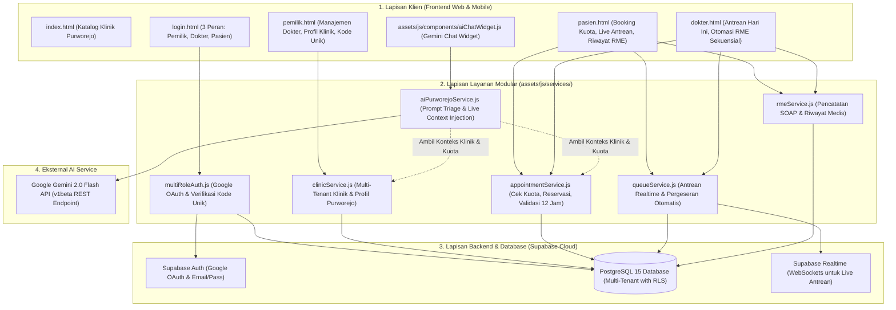

# Panduan Arsitektur Sistem (ARCHITECTURE.md)
# SIMKLINIK Purworejo — Platform Agregator Klinik Multi-Tenant Regional

---

## 1. Ikhtisar Arsitektur (Architectural Overview)

Sistem Informasi Manajemen Klinik Purworejo (**SIMKLINIK Purworejo**) dirancang menggunakan arsitektur **Multi-Tenant Service-Oriented Web Application** yang tangguh, ringan (*zero-bundler overhead*), dan terdistribusi aman menggunakan backend **Supabase (PostgreSQL 15)** serta mesin kecerdasan buatan **Google Gemini 2.0 Flash**.



---

## 2. Struktur Direktori Proyek

```text
SIMklinik_Web/
├── index.html                           # Landing page & penjelajah klinik Purworejo
├── login.html                           # Halaman masuk otentikasi (Tab: Pemilik, Dokter, Pasien)
├── pasien.html                          # Dashboard pasien (booking, antrean, riwayat RME)
├── dokter.html                          # Dashboard dokter (antrean live, auto-template RME)
├── pemilik.html                         # Dashboard pemilik klinik (kelola dokter & kode unik)
├── assets/
│   ├── css/
│   │   ├── auth.css                     # Gaya halaman login multi-peran & kode unik
│   │   ├── dashboard.css                # Layout dashboard bersama (sidebar, topbar, grid)
│   │   ├── role-pages.css               # Komponen spesifik klinik Purworejo & antrean
│   │   ├── modal.css                    # Styling dialog modal & popup data diri KK
│   │   └── ai-chat.css                  # Desain floating AI chatbot Purworejo
│   └── js/
│       ├── auth/
│       │   └── multiRoleAuth.js         # Handler otentikasi Google, username, & bind kode unik
│       ├── components/
│       │   ├── modal.js                 # Komponen modal dialog aksesibel
│       │   ├── toast.js                 # Notifikasi toast mengambang (Sukses/Error)
│       │   └── aiChatWidget.js          # Controller widget floating chat bot
│       └── services/
│           ├── clinicService.js         # Service klinik Purworejo & manajemen dokter
│           ├── appointmentService.js    # Service janji temu, cek kuota, & kunci 12 jam
│           ├── queueService.js          # Service antrean live & pergeseran sekuensial
│           ├── rmeService.js            # Service catatan medis SOAP & riwayat pasien
│           └── aiPurworejoService.js    # Service integrasi Gemini 2.0 Flash
├── config/
│   ├── supabase.js                      # Inisialisasi klien Supabase
│   ├── gemini.js                        # Konfigurasi endpoint & API key Gemini 2.0
│   └── schema-purworejo-multitenant.sql # Skrip DDL PostgreSQL 15 lengkap (Tables, Triggers, RLS)
└── docs/
    ├── PRD.md                           # Product Requirements Document resmi
    ├── ARCHITECTURE.md                  # Panduan arsitektur sistem (dokumen ini)
    └── KERANGKA_PENELITIAN.docx         # Dokumen kerangka ilmiah akademik
```

---

## 3. Skema Basis Data Relasional (PostgreSQL DDL)

Berikut adalah struktur skema database multi-tenant lengkap yang diterapkan pada Supabase:

### 3.1 Tabel Entitas Utama

```sql
-- 1. TABEL KLINIK (Multi-Tenant Entity)
CREATE TABLE public.clinics (
    id UUID PRIMARY KEY DEFAULT gen_random_uuid(),
    name VARCHAR(255) NOT NULL,
    address TEXT NOT NULL,
    district VARCHAR(100) NOT NULL, -- Kecamatan di Purworejo: Kutoarjo, Purworejo Kota, Banyuurip, dll
    phone VARCHAR(50),
    referral_code VARCHAR(30) UNIQUE NOT NULL, -- Kode unik kriptografis (e.g. PWR-SEHAT-9X8K2M)
    is_active BOOLEAN DEFAULT TRUE,
    created_at TIMESTAMPTZ DEFAULT NOW(),
    updated_at TIMESTAMPTZ DEFAULT NOW()
);

-- Index untuk pencarian cepat berdasarkan referral_code dan kecamatan
CREATE INDEX idx_clinics_referral_code ON public.clinics(referral_code);
CREATE INDEX idx_clinics_district ON public.clinics(district);

-- 2. TABEL PEMILIK KLINIK (Tenant Owner Profile)
CREATE TABLE public.clinic_owners (
    id UUID PRIMARY KEY DEFAULT gen_random_uuid(),
    user_id UUID REFERENCES auth.users(id) ON DELETE CASCADE UNIQUE NOT NULL,
    clinic_id UUID REFERENCES public.clinics(id) ON DELETE CASCADE NOT NULL,
    full_name VARCHAR(255) NOT NULL,
    email VARCHAR(255) NOT NULL,
    created_at TIMESTAMPTZ DEFAULT NOW()
);

-- 3. TABEL DOKTER (Doctor Entity per Klinik)
CREATE TABLE public.doctors (
    id UUID PRIMARY KEY DEFAULT gen_random_uuid(),
    user_id UUID REFERENCES auth.users(id) ON DELETE SET NULL UNIQUE, -- Terikat permanen saat login kode unik
    clinic_id UUID REFERENCES public.clinics(id) ON DELETE CASCADE NOT NULL,
    full_name VARCHAR(255) NOT NULL,
    specialty VARCHAR(100) NOT NULL, -- Umum, Gigi, Anak, Kandungan, dll
    sip_number VARCHAR(100) NOT NULL,
    daily_quota INT NOT NULL DEFAULT 20,
    is_active BOOLEAN DEFAULT TRUE,
    created_at TIMESTAMPTZ DEFAULT NOW()
);

CREATE INDEX idx_doctors_clinic_id ON public.doctors(clinic_id);

-- 4. TABEL JADWAL PRAKTIK DOKTER
CREATE TABLE public.doctor_schedules (
    id UUID PRIMARY KEY DEFAULT gen_random_uuid(),
    doctor_id UUID REFERENCES public.doctors(id) ON DELETE CASCADE NOT NULL,
    day_of_week INT NOT NULL CHECK (day_of_week BETWEEN 1 AND 7), -- 1=Senin, 7=Minggu
    start_time TIME NOT NULL,
    end_time TIME NOT NULL,
    session_quota INT NOT NULL DEFAULT 15,
    is_active BOOLEAN DEFAULT TRUE
);

-- 5. TABEL PROFIL PASIEN (Patient Mandatory Health Profile)
CREATE TABLE public.patients (
    id UUID PRIMARY KEY DEFAULT gen_random_uuid(),
    user_id UUID REFERENCES auth.users(id) ON DELETE CASCADE UNIQUE NOT NULL,
    full_name VARCHAR(255) NOT NULL,
    no_kk VARCHAR(16) NOT NULL,
    nik VARCHAR(16) NOT NULL,
    blood_type VARCHAR(5) CHECK (blood_type IN ('A', 'B', 'AB', 'O')),
    allergies TEXT DEFAULT 'Tidak ada',
    emergency_contact VARCHAR(50),
    created_at TIMESTAMPTZ DEFAULT NOW(),
    updated_at TIMESTAMPTZ DEFAULT NOW()
);

-- 6. TABEL JANJI TEMU & ANTREAN (Appointments & Live Queue)
CREATE TABLE public.appointments (
    id UUID PRIMARY KEY DEFAULT gen_random_uuid(),
    clinic_id UUID REFERENCES public.clinics(id) ON DELETE CASCADE NOT NULL,
    doctor_id UUID REFERENCES public.doctors(id) ON DELETE CASCADE NOT NULL,
    patient_id UUID REFERENCES public.patients(id) ON DELETE CASCADE NOT NULL,
    appointment_date DATE NOT NULL,
    appointment_time TIME NOT NULL,
    queue_number VARCHAR(20) NOT NULL, -- Contoh: A-01, A-02
    queue_order INT NOT NULL,
    status VARCHAR(30) NOT NULL DEFAULT 'menunggu' 
        CHECK (status IN ('menunggu', 'sedang_diperiksa', 'selesai', 'dibatalkan')),
    created_at TIMESTAMPTZ DEFAULT NOW(),
    CONSTRAINT unique_doctor_queue UNIQUE (doctor_id, appointment_date, queue_order)
);

CREATE INDEX idx_appointments_lookup ON public.appointments(doctor_id, appointment_date, status);

-- 7. TABEL REKAM MEDIS ELEKTRONIK (RME SOAP Form)
CREATE TABLE public.medical_records (
    id UUID PRIMARY KEY DEFAULT gen_random_uuid(),
    appointment_id UUID REFERENCES public.appointments(id) ON DELETE CASCADE UNIQUE NOT NULL,
    patient_id UUID REFERENCES public.patients(id) ON DELETE CASCADE NOT NULL,
    doctor_id UUID REFERENCES public.doctors(id) ON DELETE CASCADE NOT NULL,
    clinic_id UUID REFERENCES public.clinics(id) ON DELETE CASCADE NOT NULL,
    soap_subjective TEXT NOT NULL,
    soap_objective TEXT NOT NULL,
    soap_assessment TEXT NOT NULL,
    soap_plan TEXT NOT NULL,
    prescription_notes TEXT,
    finalized_at TIMESTAMPTZ DEFAULT NOW()
);
```

---

## 4. Mekanisme Keamanan Khusus (*Security Architecture*)

### 4.1 Generator Kode Unik Kriptografis Dokter (Anti-Salah Masuk)
Fungsi PostgreSQL untuk menghasilkan kode unik klinik:
```sql
CREATE OR REPLACE FUNCTION generate_clinic_referral_code(prefix TEXT) 
RETURNS TEXT AS $$
DECLARE
    new_code TEXT;
    chars TEXT := 'ABCDEFGHJKLMNPQRSTUVWXYZ23456789'; -- Tanpa karakter ambigu (0, O, 1, I)
    random_str TEXT := '';
    i INT;
BEGIN
    LOOP
        random_str := '';
        FOR i IN 1..6 LOOP
            random_str := random_str || substr(chars, floor(random() * length(chars) + 1)::int, 1);
        END LOOP;
        new_code := 'PWR-' || UPPER(prefix) || '-' || random_str;
        
        -- Pastikan belum pernah digunakan
        IF NOT EXISTS (SELECT 1 FROM public.clinics WHERE referral_code = new_code) THEN
            RETURN new_code;
        END IF;
    END LOOP;
END;
$$ LANGUAGE plpgsql;
```

### 4.2 Prosedur Binding Akun Dokter Saat Login
Ketika dokter login Google dan memasukkan kode unik:
```sql
CREATE OR REPLACE FUNCTION bind_doctor_with_code(p_user_id UUID, p_code TEXT, p_sip TEXT)
RETURNS JSONB AS $$
DECLARE
    v_clinic_id UUID;
    v_doctor_id UUID;
BEGIN
    -- 1. Cari klinik berdasarkan referral_code
    SELECT id INTO v_clinic_id FROM public.clinics WHERE referral_code = p_code AND is_active = TRUE;
    IF v_clinic_id IS NULL THEN
        RETURN jsonb_build_object('success', false, 'message', 'Kode klinik tidak valid atau tidak aktif.');
    END IF;

    -- 2. Cari data dokter yang didaftarkan pemilik klinik
    SELECT id INTO v_doctor_id FROM public.doctors 
    WHERE clinic_id = v_clinic_id AND sip_number = p_sip AND is_active = TRUE;
    
    IF v_doctor_id IS NULL THEN
        RETURN jsonb_build_object('success', false, 'message', 'Data dokter dengan SIP tersebut tidak terdaftar di klinik ini.');
    END IF;

    -- 3. Kunci ikatan permanen akun Google ke dokter
    UPDATE public.doctors SET user_id = p_user_id WHERE id = v_doctor_id;

    RETURN jsonb_build_object('success', true, 'clinic_id', v_clinic_id, 'doctor_id', v_doctor_id);
END;
$$ LANGUAGE plpgsql SECURITY DEFINER;
```

---

## 5. Logika Alur Bisnis Kunci

### 5.1 Validasi Pembatalan Janji 12 Jam
Pemeriksaan dilakukan baik di sisi klien (UI button greyed out) maupun di sisi database:
```sql
CREATE OR REPLACE FUNCTION cancel_appointment(p_appointment_id UUID, p_user_id UUID)
RETURNS JSONB AS $$
DECLARE
    v_appt RECORD;
    v_diff INTERVAL;
BEGIN
    SELECT * INTO v_appt FROM public.appointments WHERE id = p_appointment_id;
    
    IF v_appt IS NULL THEN
        RETURN jsonb_build_object('success', false, 'message', 'Data janji tidak ditemukan.');
    END IF;

    -- Hitung selisih waktu
    v_diff := (v_appt.appointment_date + v_appt.appointment_time)::timestamp - NOW();
    
    IF v_diff < interval '12 hours' THEN
        RETURN jsonb_build_object(
            'success', false, 
            'message', 'Janji tidak dapat dibatalkan karena waktu pemeriksaan kurang dari 12 jam.'
        );
    END IF;

    -- Batalkan janji
    UPDATE public.appointments SET status = 'dibatalkan' WHERE id = p_appointment_id;
    
    RETURN jsonb_build_object('success', true, 'message', 'Janji berhasil dibatalkan.');
END;
$$ LANGUAGE plpgsql SECURITY DEFINER;
```

### 5.2 Alur Sekuensial Selesai RME $\rightarrow$ Antrean Pasien Berikutnya
Prosedur atomik ketika dokter mengklik "Selesai & Simpan RME":
```sql
CREATE OR REPLACE FUNCTION finalize_rme_and_advance_queue(
    p_appointment_id UUID,
    p_doctor_id UUID,
    p_clinic_id UUID,
    p_patient_id UUID,
    p_subjective TEXT,
    p_objective TEXT,
    p_assessment TEXT,
    p_plan TEXT,
    p_prescription TEXT
)
RETURNS JSONB AS $$
DECLARE
    v_next_appt RECORD;
BEGIN
    -- 1. Simpan lembar RME SOAP
    INSERT INTO public.medical_records (
        appointment_id, patient_id, doctor_id, clinic_id,
        soap_subjective, soap_objective, soap_assessment, soap_plan, prescription_notes
    ) VALUES (
        p_appointment_id, p_patient_id, p_doctor_id, p_clinic_id,
        p_subjective, p_objective, p_assessment, p_plan, p_prescription
    );

    -- 2. Update janji saat ini menjadi selesai
    UPDATE public.appointments SET status = 'selesai' WHERE id = p_appointment_id;

    -- 3. Cari pasien antrean berikutnya hari ini yang berstatus 'menunggu'
    SELECT * INTO v_next_appt FROM public.appointments
    WHERE doctor_id = p_doctor_id 
      AND appointment_date = CURRENT_DATE 
      AND status = 'menunggu'
    ORDER BY queue_order ASC
    LIMIT 1;

    -- 4. Jika ada pasien berikutnya, ubah statusnya menjadi 'sedang_diperiksa'
    IF v_next_appt IS NOT NULL THEN
        UPDATE public.appointments SET status = 'sedang_diperiksa' WHERE id = v_next_appt.id;
        RETURN jsonb_build_object(
            'success', true, 
            'has_next', true, 
            'next_appointment_id', v_next_appt.id,
            'next_queue_number', v_next_appt.queue_number,
            'next_patient_id', v_next_appt.patient_id
        );
    ELSE
        RETURN jsonb_build_object(
            'success', true, 
            'has_next', false, 
            'message', 'Seluruh antrean pasien hari ini telah selesai diperiksa.'
        );
    END IF;
END;
$$ LANGUAGE plpgsql SECURITY DEFINER;
```

---

## 6. Integrasi AI Chatbot Purworejo (Gemini 2.0 Flash)

Service `aiPurworejoService.js` melakukan:
1. Pengambilan data real-time:
   * Daftar klinik aktif di Purworejo beserta kecamatannya.
   * Daftar dokter yang praktik hari ini beserta **sisa kuota** harian.
   * Jumlah antrean aktif per dokter (tingkat keramaian antrean).
2. Konstruksi Dynamic System Prompt:
   * Persona: "Sasa (Sahabat Asisten Sehat Anda) - Asisten Medis Virtual SIMKLINIK Purworejo".
   * Panduan: Triage medis awal ramah awam, rekomendasi dokter/klinik sesuai keluhan, serta menginformasikan beban antrean dan kuota.
   * Tombol Aksi: Mengeluarkan token `[ACTION:BOOK, CLINIC_ID: "...", DOCTOR_ID: "..."]` yang dirender oleh UI menjadi tombol interaktif.

---

*Dokumen ini merupakan acuan arsitektur definitif bagi Antigravity IDE untuk memandu implementasi kode sistem secara terstruktur dan konsisten.*
