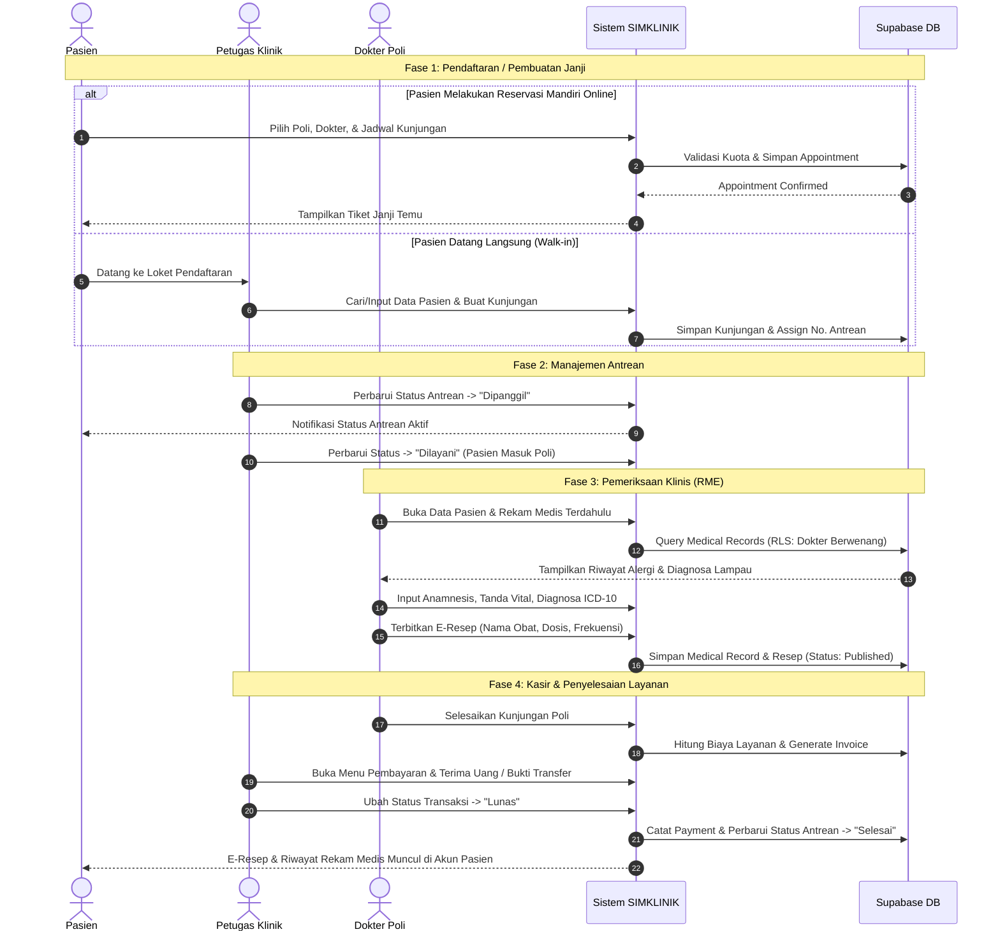
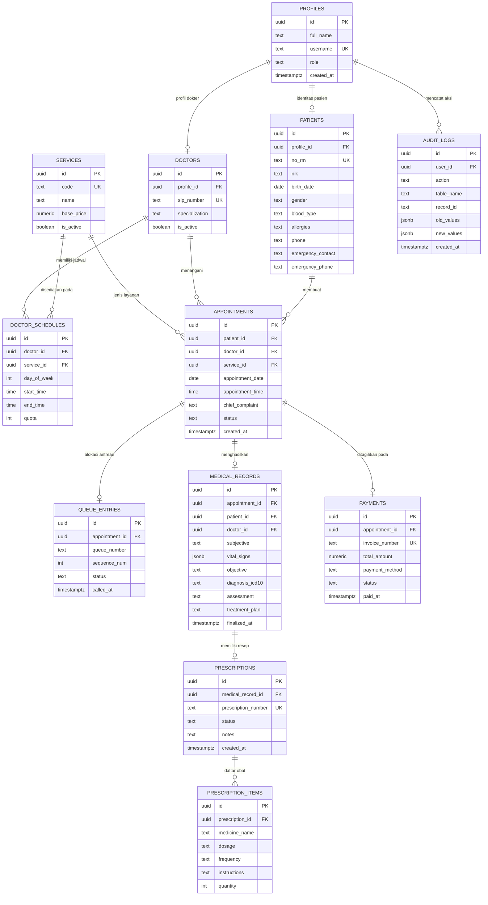

# Product Requirements Document (PRD)
# Sistem Informasi Manajemen Klinik (SIMKLINIK)

---

## Informasi Dokumen

| Properti | Keterangan |
|---|---|
| **Nama Proyek** | Sistem Informasi Manajemen Klinik (SIMKLINIK) |
| **Versi Dokumen** | 1.1 (Comprehensive & Production-Ready Specification) |
| **Tanggal Pembuatan** | 22 September 2026 |
| **Status Dokumen** | Disetujui untuk Implementasi Tahap Produksi / MVP |
| **Klasifikasi Akses** | Internal & Tim Pengembang |
| **Platform Sasaran** | Web Responsif (Desktop, Tablet, Mobile) |
| **Penyusun** | Fahmi Syafiq Ibrahim 23523164 SIMKLINIK |

---

## 1. Ringkasan Eksekutif (Executive Summary)

**SIMKLINIK** adalah platform Sistem Informasi Manajemen Klinik berbasis web modern yang dirancang untuk mengintegrasikan seluruh siklus operasional fasilitas pelayanan kesehatan tingkat pertama ke dalam satu ekosistem terpadu. Sistem ini menjembatani interaksi mandiri pasien dengan kegiatan operasional harian dokter, petugas pendaftaran/kasir, dan manajemen klinik.

Dibangun di atas arsitektur frontend web responsif yang gesit didukung oleh backend terkelola **Supabase** (PostgreSQL dengan enkripsi data dan *Row Level Security*), SIMKLINIK mengeliminasi pencatatan rekam medis kertas yang rentan hilang, mengoptimalkan waktu antrean, memfasilitasi penulisan resep digital (*e-prescription*), serta memastikan transparansi transaksi administrasi klinik.

Fondasi sistem saat ini telah memiliki subsistem autentikasi peran ganda (Pasien, Dokter, Petugas), integrasi Google OAuth, proteksi *brute-force*, *session guard*, serta antarmuka visual peran yang intuitif. Dokumen PRD ini mendefinisikan transformasi arsitektur data tiruan (*mock/demo data*) menjadi implementasi data persisten produksi, kepatuhan regulasi Permenkes No. 24 Tahun 2022 tentang Rekam Medis Elektronik (RME), dan integrasi alur operasional klinik secara menyeluruh.

---

## 2. Latar Belakang & Pernyataan Masalah

### 2.1 Latar Belakang
Banyak klinik mandiri dan pratama masih mengandalkan sistem manual berbasis buku register atau aplikasi desktop terfragmentasi tanpa konektivitas awan (*cloud*). Hal ini menyebabkan beban administrasi yang tinggi, risiko duplikasi rekam medis, antrean panjang di loket, serta kesulitan pasien dalam memantau riwayat pengobatan mereka sendiri. Selain itu, regulasi Kementerian Kesehatan Republik Indonesia mewajibkan seluruh fasilitas pelayanan kesehatan menyelenggarakan Rekam Medis Elektronik (RME) yang terstandarisasi dan aman.

### 2.2 Pernyataan Masalah (*Problem Statements*)
1. **Fragmentasi Data Pasien:** Riwayat medis pasien, data pendaftaran, resep, dan pembayaran tersimpan di buku atau lembar kerja terpisah, menghambat kolaborasi klinis yang cepat dan akurat.
2. **Pengalaman Pasien yang Terbatas:** Pasien tidak memiliki akses instan ke jadwal dokter, status antrean terkini, riwayat kunjungan, maupun salinan instruksi resep obat.
3. **Beban Administratif Loket Petugas:** Petugas klinik mengalami kemacetan input pendaftaran berulang, penomoran antrean manual tanpa sinkronisasi real-time, dan pencatatan kasir yang lambat.
4. **Alur Kerja Dokter Kurang Efisien:** Dokter memerlukan ringkasan riwayat medis pasien masa lalu secara seketika (*at-a-glance*), formulir pencatatan anamnesis yang terstandar, dan penerbitan resep tanpa harus berpindah aplikasi.
5. **Kepatuhan Privasi & Keamanan Data Medis:** Data klinis adalah data pribadi spesifik (UU No. 27/2022 tentang PDP). Perlindungan ketat berbasis peran (*Role-Based Access Control*) dan isolasi data setingkat baris (*Row Level Security*) mutlak diperlukan untuk mencegah akses tidak sah.

---

## 3. Visi Produk, Tujuan & Metrik Keberhasilan

### 3.1 Visi Produk
Menjadi sistem operasi klinik digital paling terpercaya, ringkas, dan aman yang memberdayakan tenaga medis dalam memberikan pelayanan kesehatan prima serta memberikan pasien kendali penuh atas rekam kesehatan pribadi mereka.

### 3.2 Tujuan Strategis (Product Objectives)
- **Sentralisasi Operasional:** Menggabungkan alur pendaftaran, antrean, poli klinis, e-resep, dan kasir dalam satu sistem berbasis web yang kohesif.
- **Efisiensi Waktu Pelayanan:** Memangkas durasi tunggu pendaftaran dan pencatatan rekam medis minimal 40%.
- **Transparansi & Pemberdayaan Pasien:** Menyediakan portal mandiri bagi pasien untuk membuat janji dan meninjau riwayat kesehatan mereka kapan pun dan di mana pun.
- **Integritas & Kepatuhan Data:** Menjamin kepatuhan terhadap regulasi RME, auditabilitas setiap entri data medis, dan keamanan tingkat tinggi.

### 3.3 Indikator Keberhasilan (Key Performance Indicators / Success Metrics)
| Metrik | Baseline Saat Ini | Target MVP (P0) | Target Stabil (P1) |
|---|---|---|---|
| **Waktu Pendaftaran Pasien Baru** | > 5 menit (manual) | < 2 menit | < 60 detik |
| **Akurasi Routing Role Akun** | 80% (mock) | 100% tervalidasi via DB | 100% |
| **Keterisian Rekam Medis Digital** | 0% (kertas/statis) | 100% kunjungan poli | 100% terarsip |
| **Akses Data Pasien Tidak Sah (Data Breach)** | N/A | 0 temuan insiden (RLS 100%) | 0 insiden |
| **System Uptime & Respons Halaman** | N/A | Uptime 99.5%, Respons < 2.5s | Uptime 99.9%, Respons < 1.5s |
| **Tingkat Adopsi Mandiri Pasien** | 0% | 40% pasien mendaftar online | 75% pasien |

---

## 4. Persona Pengguna & Alur Perjalanan (User Personas & Journeys)

### 4.1 Persona 1: Pasien (Aulia Rahma, 28 Tahun - Pasien Mandiri)
- **Profil:** Pekerja profesional muda yang terbiasa menggunakan ponsel cerdas dan mengutamakan kecepatan layanan tanpa antre berlama-lama.
- **Kebutuhan:**
  - Registrasi akun yang mudah via formulir atau Google Sign-In.
  - Memilih poli layanan, dokter, dan jadwal kunjungan secara online.
  - Memantau nomor antrean klinik saat ini secara langsung (*live status*).
  - Mengakses catatan rekam medis, diagnosis, dan e-resep pasca kunjungan.
- **Titik Frustrasi (*Pain Points*):** Antrean loket pendaftaran yang lama, resep kertas bertulisan sulit terbaca, kartu periksa fisik sering tertinggal.

### 4.2 Persona 2: Dokter (dr. Ayu Rahma, Sp.A, 38 Tahun - Dokter Praktik)
- **Profil:** Dokter spesialis dengan jadwal harian yang padat, memerlukan akurasi catatan klinis dan efisiensi waktu konsultasi.
- **Kebutuhan:**
  - Tampilan agenda praktik dan daftar antrean pasien hari ini yang terstruktur menurut waktu.
  - Akses cepat ke riwayat rekam medis pasien sebelum pasien masuk ruang periksa.
  - Formulir rekam medis digital yang mencakup keluhan (anamnesis), tanda vital, diagnosa (ICD-10), dan tindakan.
  - Pembuatan e-resep obat dengan dosis, aturan pakai, dan durasi secara instan.
- **Titik Frustrasi:** Berkas rekam medis manual lambat diantarkan petugas, tidak ada riwayat obat sebelumnya, beban penulisan manual resep berulang.

### 4.3 Persona 3: Petugas Klinik / Pendaftaran (Nadia Prameswari, 25 Tahun - Staf Admisi & Kasir)
- **Profil:** Petugas garis depan yang melayani pendaftaran langsung di klinik, memandu alur antrean poli, dan menerima pembayaran.
- **Kebutuhan:**
  - Formulir kilat pendaftaran pasien baru dengan pencegahan duplikasi data NIK / No. RM.
  - Kontrol panggil antrean (*queue controller*) dengan status: Menunggu, Dipanggil, Dilayani, Selesai, Batal.
  - Pengaturan jadwal dokter bertugas dan ketersediaan kuota poli.
  - Pencatatan invoice pembayaran layanan dan cetak bukti transaksi.
- **Titik Frustrasi:** Pasien komplain soal ketidakjelasan urutan nomor antrean, kesulitan mengecek apakah dokter spesialis sudah hadir.

### 4.4 Persona 4: Administrator Fasilitas Kesehatan (Bambang, 42 Tahun - IT & Operasional)
- **Profil:** Penanggung jawab operasional IT dan tata kelola akun klinik.
- **Kebutuhan:**
  - Manajemen akun staf (Dokter, Petugas, Perawat, Kasir).
  - Pengaturan katalog master data poli/layanan dan tarif dasar klinik.
  - Pemantauan *audit log* sistem untuk menelusuri aktivitas perubahan data krusial.
- **Titik Frustrasi:** Tidak adanya log aktivitas perubahan data sensitif, sulit mengubah jadwal kerja dokter secara terpusat.

---

## 5. Ruang Lingkup Produk (Product Scope)

```mermaid
flowchart TB
    subgraph MVP_Phase["Ruang Lingkup MVP (Fase 1 - Fokus Saat Ini)"]
        A1[Autentikasi Multi-Peran & Session Guard]
        A2[Login Google untuk Pasien]
        A3[Dashboard Terpersonalisasi Tiap Peran]
        A4[Pendaftaran Pasien & Manajemen Data Pasien]
        A5[Manajemen Janji Temu & Kuota Jadwal]
        A6[Sistem Antrean Layanan Poli Real-Time]
        A7[Pencatatan Rekam Medis Elektronik Dasar]
        A8[Penerbitan E-Resep & Instruksi Pemakaian]
        A9[Kasir & Pencatatan Transaksi Pembayaran]
        A10[Penyimpanan Awan & RLS Supabase]
    end

    subgraph Phase_2["Fase 2 (Ekspansi Operasional)"]
        B1[Integrasi Payment Gateway Online QRIS/VA]
        B2[Notifikasi Otomatis WhatsApp/Email]
        B3[Modul Inventaris & Stok Obat Apotek Lengkap]
        B4[Pelaporan & Analitik Keuangan Lanjutan]
        B5[Admin Panel Lengkap & Konfigurasi Tarif Dinamis]
    end

    subgraph Future_Phase["Fase Masa Depan (Ekosistem Terintegrasi)"]
        C1[Integrasi SatuSehat Kemenkes RI via API]
        C2[Klaim BPJS Kesehatan VClaim/P-Care]
        C3[Telemedisin & Konsultasi Video Terintegrasi]
        C4[Multi-Klinik / Multi-Cabang Holding]
        C5[Aplikasi Seluler Native iOS & Android]
    end

    MVP_Phase --> Phase_2 --> Future_Phase
```



### 5.1 Dalam Ruang Lingkup MVP (*In Scope*)
1. **Autentikasi & Akun:**
   - Autentikasi email dan password melalui Supabase Auth.
   - Pendaftaran mandiri akun Pasien disertai verifikasi email.
   - Login sosial Google OAuth khusus untuk Pasien.
   - Login Dokter dan Petugas menggunakan kredensial kredibel terkontrol.
   - Validasi peran (*Role Guard*) di client dan database Postgres.
   - Mekanisme proteksi *brute-force* (lockout otomatis 30 detik setelah 5 kegagalan).
2. **Antarmuka Pengguna & Navigasi Peran:**
   - Dashboard Pasien: Jadwal janji, riwayat medis, e-resep, profil kesehatan.
   - Dashboard Dokter: Pasien hari ini, jadwal praktik, form RME, formulir e-resep.
   - Dashboard Petugas: Loket pendaftaran, panggil antrean, jadwal dokter, kasir.
   - Responsif pada tampilan smartphone, tablet, maupun layar desktop kerja klinik.
3. **Data Pasien & Administrasi:**
   - Pembuatan Nomor Rekam Medis (No. RM) unik otomatis.
   - Pengelolaan profil demografis pasien, golongan darah, alergi, dan kontak darurat.
   - Validasi pencarian data pasien berdasarkan No. RM, NIK, atau Nama.
4. **Alur Pelayanan Klinis:**
   - Pembuatan reservasi janji temu dan antrean poli.
   - Pencatatan anamnesis, vital sign, diagnosa ICD-10, dan tindakan oleh Dokter.
   - Pembuatan resep obat multi-item dengan aturan pakai.
5. **Billing & Transaksi:**
   - Kalkulasi tagihan konsultasi + tindakan + resep.
   - Pencatatan status pembayaran (*Menunggu*, *Lunas*, *Dibatalkan*).
6. **Keamanan & Kepatuhan Dasar:**
   - Penerapan Row Level Security (RLS) pada seluruh tabel PostgreSQL.
   - Pencatatan jejak audit (*audit trails*) untuk akses dan modifikasi data klinis.

### 5.2 Di Luar Ruang Lingkup MVP (*Out of Scope*)
- Integrasi API SatuSehat Kemenkes / BPJS PCare (direncanakan pada Fase 2/3).
- *Payment gateway* otomatis (transfer bank virtual account / QRIS instan); pembayaran fase MVP menggunakan pencatatan kasir fisik/transfer manual.
- Modul *batch inventory*, *First-Expired-First-Out* (FEFO), dan *purchase order* apotek kompleks.
- Konsultasi telemedisin video waktu-nyata (*WebRTC*).
- Arsitektur *multi-tenant* untuk jaringan klinik waralaba / banyak cabang.

---

## 6. Arsitektur Informasi & Alur Pengguna (Information Architecture & User Flows)

### 6.1 Peta Situs & Navigasi Antarmuka

```mermaid
graph TD
    Root["Portal Masuk (login.html)"]
    Root -->|Pilih Role: Dokter| AuthDoc["Login Dokter (Username / Password)"]
    Root -->|Pilih Role: Petugas| AuthPet["Login Petugas (Username / Password)"]
    Root -->|Pilih Role: Pasien| AuthPas["Login Pasien (Email / Google OAuth / Registrasi)"]

    AuthDoc -->|Validasi Sukses| DocApp["Dokter Shell (dokter.html)"]
    DocApp --> DocDash["/dashboard (Ringkasan Praktik)"]
    DocApp --> DocPat["/pasien (Daftar Pasien Binaan)"]
    DocApp --> DocSched["/jadwal (Jadwal Praktik Dokter)"]
    DocApp --> DocMed["/rekam-medis (Input Catatan RME)"]
    DocApp --> DocPres["/resep (Penerbitan E-Resep)"]

    AuthPet -->|Validasi Sukses| PetApp["Petugas Shell (petugas.html)"]
    PetApp --> PetDash["/dashboard (Statistik Loket)"]
    PetApp --> PetPat["/pasien (Pendaftaran & Direktori Pasien)"]
    PetApp --> PetQueue["/antrean (Panggil & Atur Antrean)"]
    PetApp --> PetDoc["/dokter (Manajemen Jadwal Dokter)"]
    PetApp --> PetPay["/pembayaran (Kasir & Tagihan)"]

    AuthPas -->|Validasi Sukses| PasApp["Pasien Shell (pasien.html)"]
    PasApp --> PasDash["/dashboard (Status Kunjungan & Resep)"]
    PasApp --> PasAppt["/janji (Buat Janji & Riwayat Reservasi)"]
    PasApp --> PasMed["/rekam-medis (Rekam Medis Saya)"]
    PasApp --> PasPres["/resep (Daftar Obat Aktif)"]
    PasApp --> PasProf["/profil (Data Kesehatan & Kontak Darurat)"]
```



### 6.2 Alur Layanan Pasien Terintegrasi (*End-to-End Clinic Workflow*)



---

## 7. Spesifikasi Fitur & Persyaratan Fungsional Detail

### 7.1 Modul Autentikasi, Profil & Keamanan Sesi

| ID Fitur | Nama Fitur | Deskripsi Fungsional | Kriteria Keberhasilan & Validasi |
|---|---|---|---|
| **AUTH-01** | Multi-Role Selector | Antarmuka pemilihan peran sebelum input kredensial (Dokter, Petugas, Pasien). Form beradaptasi secara dinamis. | Field berubah otomatis (placeholder, label, tipe input email vs username). |
| **AUTH-02** | Login Pasien (Email/Pass) | Pasien masuk menggunakan alamat email yang terdaftar dan password. | Format email wajib valid; autentikasi melalui API `supabase.auth.signInWithPassword`. |
| **AUTH-03** | Login Pasien (Google OAuth) | Pasien dapat masuk seketika menggunakan Single Sign-On (SSO) Google. | Menggunakan Google Identity Services SDK; akun baru otomatis dibuatkan profil peran 'Pasien'. |
| **AUTH-04** | Login Kredensial Tim (Dokter & Petugas) | Dokter dan petugas masuk menggunakan username internal yang dipetakan ke kredensial terverifikasi. | Username dipetakan ke email klinik resmi (`@simklinik.id`) dengan otentikasi ketat. |
| **AUTH-05** | Registrasi Mandiri Pasien | Pengguna baru dapat mendaftar dengan menginput Nama Lengkap, Username, Email, dan Password terkonfirmasi. | Konfirmasi password cocok, panjang min. 6 karakter, trigger database otomatis membuat row di `public.profiles`. |
| **AUTH-06** | Session Guard & Role Routing | Pengecekan sesi token JWT pada setiap halaman terproteksi. Menolak akses tidak sah. | Jika sesi kosong, redirect ke `login.html`. Jika peran tidak sesuai halaman, redirect ke halaman dashboard perannya. |
| **AUTH-07** | Brute-Force Rate Limiter | Membatasi percobaan login yang gagal berulang dari peramban yang sama. | Kunci form selama 30 detik setelah 5x gagal, tampilkan hitung mundur visual (*timer*). |
| **AUTH-08** | Logout Aman | Menghapus sesi autentikasi pengguna secara lokal dan sisi server Supabase. | Memanggil `supabase.auth.signOut()`, membersihkan cache sesi, lalu mengarahkan ke halaman login. |

### 7.2 Modul Dashboard & Ruang Kerja Berbasis Peran

#### A. Dashboard Pasien (`pasien.html`)
- **Statistik Utama:** Janji mendatang, resep aktif, hasil pemeriksaan, indikator kepatuhan.
- **Daftar Agenda/Jadwal:** Menampilkan jadwal konsultasi yang telah dipesan lengkap dengan nama dokter, poli, tanggal, dan status.
- **Menu Janji Saya:** Formulir pembuatan janji baru dengan pemilihan tanggal, poli, dokter bertugas, dan pengisian keluhan awal.
- **Menu Rekam Medis:** Tinjauan riwayat kunjungan masa lalu (hanya data milik pasien bersangkutan yang telah difinalisasi dokter).
- **Menu Resep Saya:** Daftar instruksi obat aktif, dosis minum, frekuensi, aturan sebelum/sesudah makan, dan tanggal kedaluwarsa resep.
- **Menu Profil Kesehatan:** Pengelolaan data pribadi mandiri, mencakup golongan darah, riwayat alergi obat/makanan, dan nomor kontak darurat keluarga.

#### B. Dashboard Dokter (`dokter.html`)
- **Statistik Praktik:** Jumlah pasien antrean hari ini, jumlah konsultasi selesai, resep aktif diterbitkan, rata-rata waktu konsultasi.
- **Agenda Konsultasi Hari Ini:** Urutan antrean pasien konsultasi dilengkapi tombol aksi panggil dan periksa.
- **Manajemen Pasien Binaan:** Direktori pasien yang pernah ditangani dengan riwayat diagnosis komprehensif.
- **Modul Rekam Medis (RME):** Formulir pengisian data medis meliputi:
  - Subjektif: Keluhan utama (*Chief Complaint*), riwayat penyakit sekarang (RPS).
  - Objektif: Tanda-tanda vital (Tekanan Darah, Nadi, Laju Nafas, Suhu Tubuh), pemeriksaan fisik.
  - Asesmen: Diagnosis utama dan sekunder menggunakan kode diagnosis / ICD-10.
  - Plan: Rencana terapi, instruksi diet, anjuran kontrol kembali.
- **Modul Resep Digital (E-Prescription):** Penyusunan resep obat terstruktur (nama obat, sediaan, dosis, aturan pakai, jumlah/durasi), opsi *draft* sebelum dipublikasikan ke apotek dan pasien.

#### C. Dashboard Petugas Klinik (`petugas.html`)
- **Statistik Loket:** Jumlah antrean aktif menunggu, total pasien terdaftar hari ini, dokter aktif bertugas, rasio pembayaran lunas.
- **Manajemen Pendaftaran Pasien:** Pencarian cepat pasien lama berdasarkan No. RM / NIK / Nama, serta formulir pendaftaran pasien baru lengkap.
- **Kontrol Antrean Layanan:** Monitor antrean multi-poli; tombol aksi ubah status (*Panggil Pasien*, *Mulai Dilayani*, *Selesai*, *Batal*).
- **Penjadwalan Dokter:** Pengaturan jadwal operasional praktik dokter per poli, batas kuota antrean harian, dan status kehadiran dokter.
- **Kasir & Billing:** Ringkasan tagihan per kunjungan, rincian biaya registrasi + konsultasi + tindakan + obat, pemilihan metode pembayaran (Tunai / Transfer), serta cetak kuitansi.

---

## 8. User Stories & Kriteria Penerimaan (Acceptance Criteria)

```markdown
### US-AUTH-01: Autentikasi Pengguna Multi-Role
Sebagai pengguna sistem (Pasien, Dokter, Petugas)
Saya ingin masuk ke dalam sistem sesuai hak akses peran saya
Agar saya dapat mengakses fitur dan data kerja yang sesuai dengan kewenangan saya.

Kriteria Penerimaan (Acceptance Criteria):
[x] GIVEN pengguna berada di halaman login.html
    WHEN pengguna memilih role 'Dokter', memasukkan username valid dan password yang benar
    THEN sistem mengotentikasi sesi melalui Supabase dan mengarahkan pengguna ke dokter.html.
[x] GIVEN pengguna memilih role 'Pasien'
    WHEN pengguna memasukkan email dan password terdaftar
    THEN sistem memvalidasi profil bertipe 'Pasien' dan mengarahkan pengguna ke pasien.html.
[x] GIVEN pengguna memasukkan kredensial yang salah 5 kali berturut-turut
    THEN sistem mengunci tombol masuk selama 30 detik dan menampilkan penghitung mundur.
[x] GIVEN pengguna yang belum login mencoba langsung membuka dokter.html melalui address bar
    THEN session guard mendeteksi ketiadaan sesi dan otomatis me-redirect ke login.html.

### US-PAT-01: Pasien Melakukan Reservasi Janji Temu Mandiri
Sebagai pasien klinik
Saya ingin membuat janji temu dengan dokter pada tanggal tertentu
Agar saya memiliki kepastian waktu konsultasi dan tidak perlu mengantre manual dari pagi.

Kriteria Penerimaan:
[x] GIVEN pasien membuka menu 'Janji Saya'
    WHEN pasien memilih poli layanan, memilih dokter yang memiliki jadwal aktif, dan memilih tanggal
    THEN sistem menampilkan jam praktik dan ketersediaan kuota slot.
[x] GIVEN kuota janji dokter pada tanggal tersebut telah penuh
    THEN sistem menonaktifkan slot tersebut dan memberi pesan bahwa jadwal penuh.
[x] GIVEN pasien mengirim formulir reservasi dengan data valid
    THEN data tersimpan ke tabel appointments dengan status 'Terjadwal' dan muncul di daftar 'Janji Saya'.

### US-DOC-01: Pengisian Rekam Medis Elektronik oleh Dokter
Sebagai dokter pemeriksa
Saya ingin mencatat hasil pemeriksaan klinis pasien ke dalam formulir rekam medis
Agar riwayat kesehatan pasien terdokumentasi secara legal, terstruktur, dan aman.

Kriteria Penerimaan:
[x] GIVEN dokter membuka pasien yang sedang berstatus 'Dilayani'
    WHEN dokter membuka modul rekam medis
    THEN dokter dapat melihat ringkasan alergi dan riwayat kunjungan lampau pasien tersebut.
[x] GIVEN dokter mengisi anamnesis, vital sign (tensi, suhu, nadi), dan diagnosis
    WHEN dokter menekan tombol 'Simpan Rekam Medis'
    THEN data tersimpan secara permanen dengan foreign key dokter_id dan patient_id.
[x] GIVEN rekam medis telah difinalisasi
    THEN pasien dapat melihat diagnosa dan instruksi dokter melalui dashboard pasien miliknya.

### US-STF-01: Pengelolaan Antrean oleh Petugas Pendaftaran
Sebagai petugas klinik
Saya ingin memanggil nomor antrean dan memperbarui status layanan
Agar alur sirkulasi pasien di ruang tunggu berjalan tertib dan terorganisir.

Kriteria Penerimaan:
[x] GIVEN pasien baru didaftarkan ke poli
    WHEN petugas menyimpan pendaftaran kunjungan
    THEN sistem menerbitkan nomor antrean berurutan (misal: A-001) untuk hari bersangkutan.
[x] GIVEN antrean berstatus 'Menunggu'
    WHEN petugas menekan tombol 'Panggil'
    THEN status antrean berubah menjadi 'Dipanggil' dan waktu panggilan tercatat.
[x] GIVEN pasien memasuki ruang konsultasi dokter
    WHEN status diubah menjadi 'Dilayani'
    THEN data antrean dokter bersangkutan langsung tersinkronisasi.
```

---

## 9. Desain Skema Basis Data & Kebijakan Keamanan (Database & RLS)

Sistem menggunakan basis data relasional **PostgreSQL** yang dikelola melalui Supabase dengan arsitektur Row Level Security (RLS) untuk menjamin pemisahan data tingkat baris.



### 9.1 Kebijakan Row Level Security (RLS Matrix)

| Tabel | Role Pasien | Role Dokter | Role Petugas | Role Admin |
|---|---|---|---|---|
| `profiles` | Baca & Edit milik sendiri | Baca sendiri, baca data pasien binaan | Baca seluruh profil pasien | Baca & Kelola semua |
| `patients` | Baca & Edit data profil sendiri | Baca pasien yang memiliki janji dengannya | Baca & Input seluruh data pasien | Baca & Kelola semua |
| `doctors` | Baca data dokter aktif | Baca data sendiri & sesama dokter | Baca seluruh data dokter | Kelola semua |
| `services` | Baca layanan aktif | Baca layanan aktif | Baca seluruh layanan | Kelola semua |
| `doctor_schedules`| Baca jadwal praktik | Baca jadwal praktik sendiri | Baca & kelola jadwal praktik | Kelola semua |
| `appointments` | Baca & Buat janji milik sendiri | Baca janji pasiennya | Baca & Kelola seluruh janji | Kelola semua |
| `queue_entries` | Baca antrean hari ini | Baca & Update antrean polinya | Kelola panggil/selesai antrean | Kelola semua |
| `medical_records`| Baca rekam medis miliknya yang sudah final | Baca & Tulis rekam medis pasiennya | Dibatasi (hanya status administratif) | Baca metadata audit |
| `prescriptions` | Baca resep aktif miliknya | Buat & Update resep pasiennya | Baca untuk penyiapan apotek | Kelola semua |
| `payments` | Baca tagihan miliknya | Tidak dapat mengubah | Input & Validasi pembayaran | Kelola semua laporan |
| `audit_logs` | Tidak ada akses | Tidak ada akses | Tidak ada akses | Baca jejak audit sistem |

---

## 10. Persyaratan Non-Fungsional (Non-Functional Requirements)

### 10.1 Keamanan & Privasi Data Medis (Security & Privacy)
- **Kepatuhan Regulasi:** Mengacu pada **Permenkes No. 24 Tahun 2022** tentang Rekam Medis dan **UU No. 27 Tahun 2022** tentang Perlindungan Data Pribadi (PDP).
- **Enkripsi Data:** Wajib menggunakan HTTPS/TLS 1.3 dalam seluruh transmisi data. Data sensitif pada PostgreSQL dienkripsi saat *rest* (*encryption at rest*).
- **Manajemen Kunci Kredensial:** Hanya `SUPABASE_ANON_KEY` yang diizinkan berada pada peramban klien. Kunci `SUPABASE_SERVICE_ROLE_KEY` dilarang keras disertakan dalam kode frontend.
- **Proteksi Akses:** Wajib menerapkan mekanisme CSRF token lokal, sanitasi input HTML untuk mencegah *Cross-Site Scripting* (XSS), dan parameterized queries/ORM pada lapisan Supabase untuk mencegah *SQL Injection*.

### 10.2 Kinerja & Kecepatan Respons (Performance & SLA)
- **First Contentful Paint (FCP):** Kurang dari 1.2 detik pada jaringan 4G stabil.
- **Waktu Transisi Dashboard:** Perpindahan antar tampilan sub-halaman (*tab view*) kurang dari 300 ms.
- **Beban Database:** Query operasional dashboard harian wajib memanfaatkan indeks pada kolom kunci (`patient_id`, `doctor_id`, `appointment_date`, `status`).

### 10.3 Aksesibilitas & Responsivitas (UI/UX & Accessibility)
- **Dukungan Layar:** Mendukung responsif penuh dari layar *smartphone* (resolusi mulai 360x640 px), tablet (768 px), hingga desktop monitor klinik (1920x1080 px).
- **Standar Aksesibilitas:** Memenuhi pedoman **WCAG 2.1 Level AA** dengan rasio kontras warna teks terhadap latar belakang minimal 4.5:1.
- **Fokus Form & Navigasi Keyboard:** Seluruh kontrol tombol dan field input memiliki outline fokus yang jelas (`:focus-visible`) serta mendukung navigasi tombol *Tab* dan *Enter*.

### 10.4 Keandalan & Penanganan Kesalahan (Reliability & Fault Tolerance)
- **Pesan Kesalahan Manusiawi:** Setiap kegagalan jaringan atau penolakan query menyajikan pesan umpan balik (*toast/alert*) yang informatif dan ramah pengguna, bukan kode error mentah sistem.
- **Pencegahan Klik Berulang (*Idempotency*):** Tombol submit transaksi, booking janji, dan simpan rekam medis otomatis dinonaktifkan (*disabled*) dengan indikator pemintal (*spinner*) selama operasi async berlangsung untuk mencegah duplikasi entri data.

---

## 11. Analisis Risiko & Matriks Mitigasi

| Kode | Potensi Risiko | Probabilitas | Dampak | Strategi Mitigasi Proaktif |
|---|---|---|---|---|
| **RSK-01** | Kebocoran data rekam medis antar pengguna | Rendah | Kritis | Audit ketat Row Level Security (RLS) di Supabase; blokir akses SELECT/UPDATE selain pemilik sah atau dokter berizin. |
| **RSK-02** | Tabrakan kuota / double booking dokter di jam yang sama | Sedang | Tinggi | Terapkan *unique constraint* kombinasi `(doctor_id, appointment_date, appointment_time)` dan transaksi isolasi serializable di PostgreSQL. |
| **RSK-03** | Petugas salah memilih identitas pasien saat pendaftaran | Sedang | Tinggi | Tampilkan konfirmasi identitas ganda (Nama Lengkap, NIK, Tanggal Lahir, Alamat) sebelum memasukkan pasien ke antrean. |
| **RSK-04** | Koneksi internet klinik mengalami gangguan sewaktu-waktu | Tinggi | Sedang | Terapkan penanganan timeout yang anggun (*graceful offline notification*), simpan draft formulir lokal pada `sessionStorage` sebelum submit. |
| **RSK-05** | Pasien lansia kesulitan menggunakan platform digital | Sedang | Sedang | Tetap sediakan alur *walk-in registration* di mana petugas loket dapat menginputkan janji dan antrean atas nama pasien secara manual. |

---

## 12. Rencana Rilis & Roadmap Pengembangan

```mermaid
timeline
    title Roadmap Peluncuran SIMKLINIK
    section Sprint 1-2 : Fondasi & Migrasi Database
        Penyelesaian Skema Supabase RLS : Schema lengkap 12 tabel
        Migrasi Mock Data ke Supabase : Repository query dinamis
        Pengujian Autentikasi & Brute Force : Validasi multi-role 100%
    section Sprint 3-4 : Alur Klinis Utama (MVP)
        Modul Janji Temu & Kuota : Reservasi online pasien
        Modul Antrean Loket & Panggil : Sinkronisasi realtime petugas
        Modul RME & E-Resep : Catatan dokter & resep aktif
    section Sprint 5 : Billing & User Acceptance Test (UAT)
        Modul Kasir & Kuitansi : Pencatatan pembayaran lunas
        UAT Tenaga Medis & Pasien : Uji coba skenario operasional penuh
        Peluncuran Produksi Versi 1.0 : Deploy live klinik
    section Fase Berikutnya : Integrasi Lanjutan
        Fase 2 : Notifikasi WhatsApp & Integrasi QRIS
        Fase 3 : Integrasi SatuSehat Kemenkes RI (PMK 24/2022)
```

### 12.1 Rincian Milestone Rilis
1. **Milestone 1 (Sprint 1 - Fondasi Persistensi):** Migrasi skema database Supabase produksi, aktivasi tabel `patients`, `doctors`, `services`, `appointments`, `medical_records`, `prescriptions`, dan penyusunan fungsi trigger audit.
2. **Milestone 2 (Sprint 2 - Alur Kerja Petugas & Pasien):** Integrasi live data reservasi, pendaftaran walk-in oleh petugas, dan sistem antrean display loket.
3. **Milestone 3 (Sprint 3 - Modul Dokter & Klinis):** Implementasi input RME dokter, formulir pembuatan resep berulang, dan sinkronisasi tampilan resep di sisi pasien.
4. **Milestone 4 (Sprint 4 - Kasir, UAT & Peluncuran MVP):** Pembayaran tagihan, pengujian keamanan RLS secara menyeluruh, pelatihan staf klinik, dan *Go-Live*.

---

## 13. Definisi Selesai (Definition of Done - DoD)

Suatu fitur atau modul dinyatakan selesai (*Done*) dan siap dipublikasikan ke lingkungan produksi hanya jika memenuhi kriteria berikut:
1. **Implementasi Kode:** Kode ditulis bersih, modular, mengikuti standar HTML5/CSS3/Vanilla ES6+, serta tidak memiliki kredensial sensitif (*hard-coded keys*).
2. **Verifikasi Database & RLS:** Seluruh tabel terkait telah dilindungi RLS dan telah lolos uji penetrasi positif (role sah) dan negatif (role tidak sah diblokir).
3. **Pembersihan Data Demo:** Tidak ada data statis tiruan yang tersisa di alur utama produksi.
4. **Kompatibilitas Layar:** Berhasil diuji dan tampil rapi pada browser Chrome, Firefox, Safari, Edge baik pada mode Desktop maupun Mobile (iOS/Android).
5. **Penanganan Kondisi:** Menyediakan state lengkap: *Loading skeleton/spinner*, *Empty state* informatif, *Error state* komunikatif, dan *Success feedback*.
6. **Kaji Ulang Rekan (*Code Review*):** Telah melalui peninjauan kode dan disetujui oleh *Lead Developer*.

---

## 14. Pertanyaan Terbuka & Rekomendasi Arsitektur Masa Depan

1. **Format Penomoran Rekam Medis (No. RM):**
   - *Rekomendasi:* Gunakan format standar 6 digit bertahap (contoh: `RM-000001` atau `YYMM-0001`) yang digenerate melalui PostgreSQL sequence agar urut dan tidak pernah duplikat.
2. **Kewenangan Koreksi Catatan Medis Pasca Finalisasi:**
   - *Rekomendasi:* Sesuai prinsip medikolegal, catatan rekam medis yang telah difinalisasi tidak boleh ditimpa (*no hard update/delete*). Jika ada ralat dokter, dibuatkan entri *addendum* revisi dengan pencatatan timestamp dan identitas dokter.
3. **Integrasi WhatsApp Gateway:**
   - *Rekomendasi:* Pada Fase 2, tambahkan penyedia WhatsApp Business API (misal: Twilio atau Fonnte) untuk mengirim pengingat jadwal janji otomatis kepada pasien H-1 kunjungan demi meminimalkan tingkat ketidakhadiran (*no-show rate*).
4. **Kepatuhan Platform SatuSehat (Kemenkes):**
   - *Rekomendasi:* Desain skema data RME SIMKLINIK sejak awal telah memetakan variabel vital sign dan kode diagnosa ICD-10/ICD-9-CM agar saat webhook FHIR API SatuSehat diimplementasikan di Fase 3, proses mapping data berlangsung lancar.

---
*Dokumen ini merupakan spesifikasi resmi pengembangan Sistem Informasi Manajemen Klinik (SIMKLINIK). Setiap perubahan ruang lingkup harus melalui prosedur Change Request terverifikasi.*
