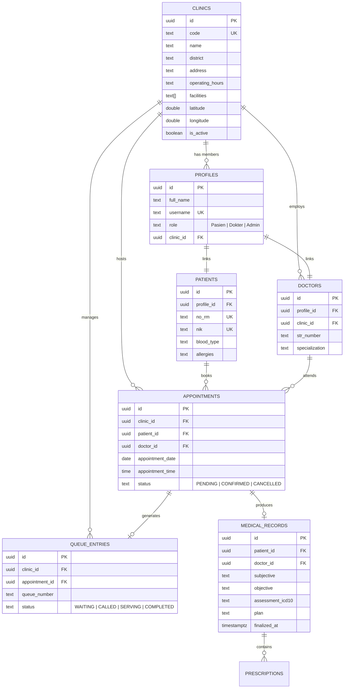

# Product Requirements Document (PRD)
# SIMKLINIK 2.0 — Platform Agregator Multi-Klinik Regional Kabupaten Purworejo

---

## Informasi Dokumen

| Properti | Keterangan |
|---|---|
| **Nama Produk** | SIMKLINIK (Sistem Informasi Manajemen Klinik Regional) |
| **Versi Dokumen** | 2.0 (Regional Multi-Clinic Platform & 2-Role Direct Healthcare Model) |
| **Tanggal Efektif** | 6 Oktober 2026 |
| **Status Dokumen** | **APPROVED & ACTIVE IMPLEMENTATION** |
| **Wilayah Sasaran** | Kabupaten Purworejo, Jawa Tengah (Pilot: Purworejo Kota, Kutoarjo, Banyuurip) |
| **Model Ekosistem** | **2-Peran Mandiri (Direct Pasien $\leftrightarrow$ Dokter per Klinik)** |
| **Regulasi & Standar** | Permenkes No. 24/2022 (RME SOAP & ICD-10), UU PDP No. 27/2022, WCAG 2.1 AA |
| **Stack Teknologi** | HTML5 Semantic, Vanilla CSS (Design Tokens), Vanilla ES6+, Supabase PostgreSQL 15, Gemini 2.0 Flash |

---

## 1. Ringkasan Eksekutif (Executive Summary)

**SIMKLINIK 2.0** merepresentasikan transformasi arsitektur menyeluruh dari sistem informasi klinik mandiri (*single-tenant internal software*) menjadi **Platform Agregator Layanan Faskes Regional Terpadu** yang berfokus di **Kabupaten Purworejo, Jawa Tengah**.

Platform ini memecahkan masalah fragmentasi layanan kesehatan primer di tingkat kabupaten dengan mengintegrasikan klinik-klinik pratama swasta dan mandiri ke dalam satu ekosistem digital bersama. Melalui platform ini, masyarakat Purworejo dapat:
1. Menemukan faskes klinik terdekat berdasarkan kecamatan (*Purworejo Kota*, *Kutoarjo*, *Banyuurip*).
2. Memantau kepadatan antrean pasien dan ketersediaan kuota dokter secara *live* antar-klinik.
3. Melakukan reservasi langsung ke dokter spesialis/umum di faskes pilihan.

### Eliminasi Peran Petugas (The 2-Role Paradigm Shift)
Dalam arsitektur 2.0, sistem mengeliminasi ketergantungan pada loket fisik petugas admisi:
- **Alasan Eliminasi:** Keberadaan peran petugas loket pada sistem digital menciptakan *bottleneck* manual (antrean fisik di loket, waktu tunggu input ganda, dan friksi administratif).
- **Model Baru (Pasien $\leftrightarrow$ Dokter Langsung):** Pasien melakukan pendaftaran mandiri terintegrasi NIK, memilih faskes & dokter, serta terbit tiket antrean secara otomatis. Di ruang periksa, dokter mengelola, memanggil (*Panggil*), dan melayani (*Layani*) antrean secara mandiri tanpa perantara.

---

## 2. Latar Belakang & Pernyataan Masalah

### 2.1 Konteks Wilayah: Kabupaten Purworejo
Kabupaten Purworejo memiliki karakteristik geografis yang membagi pusat aktivitas dan sebaran faskes:
- **Kecamatan Purworejo (Pusat Pemerintahan & Kota):** Kepadatan penduduk tinggi dengan konsentrasi klinik umum dan spesialis gigi.
- **Kecamatan Kutoarjo (Sentra Perdagangan & Transportasi Barat):** Mobilitas tinggi, membutuhkan faskes dengan layanan rawat jalan dan fasilitas bersalin/KIA.
- **Kecamatan Banyuurip (Wilayah Penyangga Strategis):** Area berkembang di jalur arteri yang membutuhkan akses faskes keluarga dan pemeriksaan laboratorium cepat.

### 2.2 Pernyataan Masalah (*Problem Statements*)
1. **Ketimpangan Beban Antrean Antar-Faskes:** Pasien sering menumpuk di satu klinik di pusat kota Purworejo hingga antrean membeludak, sementara klinik di kecamatan tetangga (Kutoarjo/Banyuurip) masih memiliki kuota dokter yang longgar.
2. **Ketiadaan Visibilitas Lintas Faskes:** Pasien harus mendatangi klinik secara fisik atau menghubungi satu per satu melalui WhatsApp untuk menanyakan apakah dokter praktik hari ini atau apakah kuota masih tersedia.
3. **Penyelenggaraan RME yang Terisolasi:** Banyak klinik pratama di daerah belum mengadopsi Rekam Medis Elektronik (RME) berstandar Permenkes No. 24/2022 karena mahalnya biaya pembangunan server internal.
4. **Friksi Loket Konvensional:** Antrean fisik di loket pendaftaran memperlambat penanganan medis darurat/akut dan menurunkan kepuasan pasien.

---

## 3. Visi Produk, Sasaran & Nilai Kebaruan (Novelty)

### 3.1 Visi Produk
Menjadi infrastruktur digital agregator kesehatan nomor satu di Kabupaten Purworejo yang menghubungkan masyarakat dengan faskes primer terpercaya secara transparan, adil, cepat, dan terstandar nasional.

### 3.2 Nilai Kebaruan Penelitian & Pengembangan (Novelty)
- **Regional Healthcare Balancing:** Mengurangi beban puncak faskes kota dengan mendistribusikan pasien ke klinik mitra sekitarnya berbasis data waktu-nyata (*real-time queue load*).
- **AI-Powered Clinic & Queue Triage:** Menyediakan konteks data faskes (`window.getClinicsContextForAi()`) yang menghubungkan keluhan awam pasien dengan rekomendasi klinik spesifik, jarak tempuh, dan estimasi waktu tunggu antrean.
- **Ultra-Lean 2-Role Operation:** Memberdayakan klinik kecil mandiri untuk langsung go-digital tanpa perlu merekrut staf administrasi TI khusus.

---

## 4. Jaringan 3 Klinik Pilot (Kabupaten Purworejo)

Platform SIMKLINIK 2.0 diluncurkan dengan 3 klinik percontohan terdaftar:

| Kode Klinik | Nama Fasilitas Kesehatan | Kecamatan | Alamat Lengkap | Layanan Poliklinik | Jam Operasional |
|---|---|---|---|---|---|
| `KLN-PWR-01` | **Klinik Pratama Sehat Mandiri Purworejo** | Purworejo (Kota) | Jl. Brigjen Katamso No. 42, Pangenrejo | Poli Umum, Poli Gigi, Farmasi | 08:00 - 21:00 WIB |
| `KLN-PWR-02` | **Klinik Pratama & Bersalin Kutoarjo Medika** | Kutoarjo | Jl. Pangeran Diponegoro No. 18 | Poli Umum, Poli KIA/Kebidanan, UGD 24 Jam, Farmasi | 24 Jam (Poli: 08:00 - 20:00) |
| `KLN-PWR-03` | **Klinik Pratama Keluarga Banyuurip** | Banyuurip | Jl. Tentara Pelajar No. 88, Boro Kulon | Poli Umum, Laboratorium Darah Cepat, Farmasi | 07:30 - 20:30 WIB |

---

## 5. Persona Pengguna & Alur Kerja (User Personas & Workflows)

### 5.1 Persona 1: Pasien Mandiri
- **Profil:** Budi Santoso, 34 tahun, warga Pangenrejo, Purworejo Kota.
- **Kebutuhan:** Memeriksakan keluhan sakit gigi tanpa harus menunggu 2 jam di ruang tunggu faskes; ingin melihat riwayat diagnosa dan obat dari kunjungan sebelumnya.
- **Alur Kerja Pasien:**
  1. Pasien membuka portal `pasien.html`.
  2. Sistem menampilkan sapaan dinamis waktu nyata (*Pagi/Siang/Sore/Malam, Budi*).
  3. Pasien memfilter klinik berdasarkan kecamatan (*Purworejo, Kutoarjo, Banyuurip*).
  4. Pasien memeriksa status operasional dan kuota dokter.
  5. Jika profil identitas (NIK/kontak) atau profil medis (golongan darah/alergi) belum lengkap, sistem memicu modal dialog pengisian wajib demi keselamatan klinis.
  6. Pasien memilih faskes, poliklinik, dokter, dan waktu reservasi.
  7. Tiket nomor antrean (`A-001`, `B-002`) terbit secara instan dan live status terpantau di dasbor.

### 5.2 Persona 2: Dokter Faskes Mandiri
- **Profil:** dr. Dimas Putra, 38 tahun, dokter praktik di Klinik Pratama Sehat Mandiri Purworejo.
- **Kebutuhan:** Antarmuka ringkas tanpa distraksi; dapat memanggil pasien berikutnya langsung dari meja periksa, melihat riwayat RME sebelumnya, mencatat SOAP ICD-10, dan menerbitkan e-resep.
- **Alur Kerja Dokter:**
  1. Dokter login melalui `login.html` memilih role **Dokter**.
  2. Dokter masuk ke `dokter.html` dan memilih klinik aktif melalui switcher header (`#doctorClinicSelector`).
  3. Dasbor dokter memuat antrean tersaring hanya untuk faskes dan jadwal praktiknya.
  4. Dokter menekan tombol **Panggil Antrean** $\rightarrow$ status pasien berubah menjadi `CALLED` disertai notifikasi audio/visual.
  5. Pasien masuk ke ruang periksa $\rightarrow$ dokter menekan **Mulai Periksa** (`SERVING`).
  6. Dokter mengisi formulir Rekam Medis SOAP:
     - **S (Subjective):** Keluhan utama dan anamnesis.
     - **O (Objective):** Tanda vital (TD mmHg, Nadi bpm, Suhu °C, RR napas/menit) & pemeriksaan fisik.
     - **A (Assessment):** Diagnosa primer/sekunder terintegrasi kodifikasi standar ICD-10 WHO.
     - **P (Plan):** Rencana terapi, edukasi pasien, dan tabel obat e-resep.
  7. Dokter menekan **Finalisasi RME** $\rightarrow$ dokumen rekam medis terkunci permanen sesuai Permenkes No. 24/2022 dan riwayat langsung muncul di dasbor pasien.

---

## 6. Spesifikasi Kebutuhan Fungsional (Functional Requirements)

### 6.1 Modul Direktori Klinik Regional Purworejo
- **FR-CLN-01 (Katalog Faskes):** Menampilkan kartu klinik interaktif dengan nama, kecamatan, alamat, jam buka, fasilitas poliklinik, dan indikator beban antrean.
- **FR-CLN-02 (Filter Kecamatan):** Filter instan satu-klik dengan pill filter: *Semua Faskes*, *Kec. Purworejo (Kota)*, *Kec. Kutoarjo*, *Kec. Banyuurip*.
- **FR-CLN-03 (Booking Shortcut):** Tombol "Buat Janji di Faskes Ini" pada setiap kartu klinik yang otomatis memilihkan faskes tujuan pada formulir reservasi.
- **FR-CLN-04 (Pengecekan Kuota):** Menghitung sisa kuota dokter per faskes secara real-time dari relasi tabel `doctor_schedules` dan `appointments`.

### 6.2 Modul Portal Pasien & Keselamatan Medis
- **FR-PAS-01 (Gatekeeper Kelengkapan Profil):** Mencegah pembuatan janji temu jika data mandatori belum diisi:
  - *Data Kependudukan:* Nama lengkap, NIK 16-digit tervalidasi, No. HP, Alamat domisili.
  - *Data Profil Medis:* Golongan darah (A, B, AB, O) dan riwayat alergi obat/makanan.
- **FR-PAS-02 (Antrean Digital Otomatis):** Jika reservasi dijadwalkan pada hari yang sama, sistem langsung menerbitkan entri `queue_entries` dengan nomor urut poli.
- **FR-PAS-03 (Transparansi RME & E-Resep):** Pasien dapat melihat seluruh riwayat pemeriksaan yang berstatus `FINAL`, catatan diagnosis dokter, serta petunjuk minum obat resep.
- **FR-PAS-04 (Sapaan Dinamis & Keamanan Akun):** Ucapan selamat datang menyesuaikan zona waktu lokal (WIB) dan integrasi ubah kata sandi mandiri.

### 6.3 Modul Portal Dokter Mandiri & Afiliasi Klinik
- **FR-DOC-01 (Afiliasi Faskes):** Header selector klinik aktif yang mengisolasi antrean dan kunjungan sesuai faskes tempat dokter bertugas hari itu.
- **FR-DOC-02 (Kontrol Antrean Meja Periksa):** Tombol aksi cepat *Panggil* dan *Layani* yang memperbarui status antrean secara instan.
- **FR-DOC-03 (Pencatatan SOAP & Validasi ICD-10):** Validasi otomatis kelengkapan tanda vital dan pencarian kodifikasi diagnosis ICD-10 WHO.
- **FR-DOC-04 (Penerbitan E-Resep):** Penambahan multi-item obat dengan dosis, jumlah, dan aturan pemakaian tanpa perlu formulir kertas.
- **FR-DOC-05 (Penguncian Mutlak RME):** Pasca tombol `Finalisasi Rekam Medis` ditekan, record diberi timestamp `finalized_at` dan dilindungi oleh RLS dari perubahan retroaktif.

### 6.4 Modul Kecerdasan Buatan (AI Health & Clinic Recommender Suite)
- **FR-AI-01 (Konteks Faskes Regional):** Penyediaan API internal `window.getClinicsContextForAi()` yang mengemas profil 3 klinik, koordinat, layanan, dan antrean aktif ke format JSON terstruktur untuk dikonsumsi LLM.
- **FR-AI-02 (Triage Geografis & Rekomendasi Klinik):** Asisten chatbot cerdas yang menganalisis keluhan pengguna, memetakan ke poliklinik yang sesuai, dan merekomendasikan faskes di Purworejo dengan waktu tunggu paling optimal.
- **FR-AI-03 (Pemeriksa Keamanan Resep):** Pengecekan potensi interaksi obat atau kontraindikasi alergi pasien berbasis Gemini 2.0 Flash.
- **FR-AI-04 (Penyusun Draf SOAP Dokter):** Konversi catatan anamnesis bebas menjadi draf terstruktur SOAP 4-bagian.

---

## 7. Arsitektur Data & Skema Database Supabase

### 7.1 Tabel Relasional Utama


```mermaid
erDiagram
    CLINICS ||--o{ PROFILES : "has members"
    CLINICS ||--o{ DOCTORS : "employs"
    CLINICS ||--o{ APPOINTMENTS : "hosts"
    CLINICS ||--o{ QUEUE_ENTRIES : "manages"
    PROFILES ||--|| PATIENTS : "links"
    PROFILES ||--|| DOCTORS : "links"
    PATIENTS ||--o{ APPOINTMENTS : "books"
    DOCTORS ||--o{ APPOINTMENTS : "attends"
    APPOINTMENTS ||--o| QUEUE_ENTRIES : "generates"
    APPOINTMENTS ||--o| MEDICAL_RECORDS : "produces"
    MEDICAL_RECORDS ||--o{ PRESCRIPTIONS : "contains"

    CLINICS {
        uuid id PK
        text code UK
        text name
        text district
        text address
        text operating_hours
        text[] facilities
        double latitude
        double longitude
        boolean is_active
    }

    PROFILES {
        uuid id PK
        text full_name
        text username UK
        text role "Pasien | Dokter | Admin"
        uuid clinic_id FK
    }

    PATIENTS {
        uuid id PK
        uuid profile_id FK
        text no_rm UK
        text nik UK
        text blood_type
        text allergies
    }

    DOCTORS {
        uuid id PK
        uuid profile_id FK
        uuid clinic_id FK
        text str_number
        text specialization
    }

    APPOINTMENTS {
        uuid id PK
        uuid clinic_id FK
        uuid patient_id FK
        uuid doctor_id FK
        date appointment_date
        time appointment_time
        text status "PENDING | CONFIRMED | CANCELLED"
    }

    QUEUE_ENTRIES {
        uuid id PK
        uuid clinic_id FK
        uuid appointment_id FK
        text queue_number
        text status "WAITING | CALLED | SERVING | COMPLETED"
    }

    MEDICAL_RECORDS {
        uuid id PK
        uuid patient_id FK
        uuid doctor_id FK
        text subjective
        text objective
        text assessment_icd10
        text plan
        timestamptz finalized_at
    }
```

---

## 8. Kepatuhan Regulasi, Keamanan & Kinerja

### 8.1 Regulasi Kesehatan & Hukum
1. **Permenkes No. 24 Tahun 2022 (Rekam Medis Elektronik):**
   - Struktur data klinis wajib mencakup SOAP lengkap dan kodifikasi ICD-10.
   - Hak koreksi medis hanya berlaku sebelum finalisasi; pasca finalisasi data terkunci mutlak dan tercatat di audit log.
2. **UU No. 27 Tahun 2022 (Pelindungan Data Pribadi):**
   - Data medis pasien diklasifikasikan sebagai Data Pribadi Spesifik.
   - Penerapan *Row Level Security* (RLS) PostgreSQL memastikan pasien hanya dapat membaca RME milik dirinya sendiri (`auth.uid() = profile_id`).
   - Dokter hanya dapat mengakses data pasien yang terdaftar dalam reservasi/antrean kliniknya.

### 8.2 Non-Functional Requirements (NFR)
- **Performa Muat (LCP):** Waktu Largest Contentful Paint $< 1.2$ detik pada koneksi 4G seluler.
- **Zero Framework Bloat:** Dibangun dengan Vanilla Web stack untuk efisiensi transfer data dan pemeliharaan jangka panjang tanpa ketergantungan paket rapuh.
- **Aksesibilitas:** Kontras warna minimum 4.5:1, semantik ARIA lengkap pada seluruh dialog modal (`role="dialog"`, `aria-modal="true"`, focus trap).

---

## 9. Roadmap Pengembangan & Rilis

```
Q4 2026: Fase 1 (Selesai & Aktif)
├── Transformasi Arsitektur Multi-Klinik Regional Kabupaten Purworejo
├── Implementasi 3 Faskes Pilot (Purworejo Kota, Kutoarjo, Banyuurip)
├── Eliminasi Total Peran Petugas Loket (Direct Pasien-Dokter)
├── Integrasi Direktori Klinik & Janji Temu Terpusat
└── Verifikasi Pengujian Otomatis 100% Pass

Q1 2027: Fase 2 (Pengembangan Lanjutan)
├── Integrasi AI Chatbot Rekomendasi Faskes & Antrean Mandiri
├── Integrasi Peta Interaktif Sebaran Faskes Kab. Purworejo (Leaflet / Google Maps)
└── Fitur Panggilan Suara Antrean Otomatis (Web Speech API) di Meja Dokter

Q2 2027: Fase 3 (Ekspansi Regional)
├── Pembukaan Kemitraan ke 16 Kecamatan Se-Kabupaten Purworejo
├── Integrasi Standar SatuSehat Kemenkes RI via FHIR API
└── Integrasi Bridging BPJS Kesehatan P-Care
```

---

*Dokumen ini diterbitkan secara resmi sebagai acuan tunggal arsitektur dan spesifikasi kebutuhan produk SIMKLINIK 2.0.*
