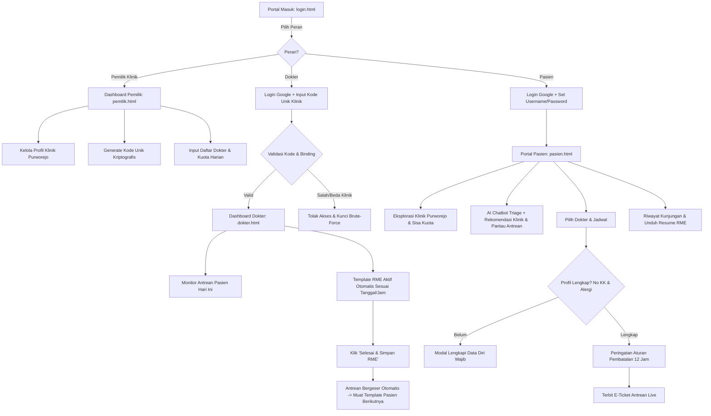

# Product Requirements Document (PRD)
# SIMKLINIK Purworejo — Platform Agregator Klinik Multi-Tenant Regional

---

## Informasi Dokumen

| Properti | Keterangan |
|---|---|
| **Nama Proyek** | Sistem Informasi Manajemen Klinik Multi-Tenant Regional (SIMKLINIK Purworejo) |
| **Judul Penelitian** | Pengembangan Aplikasi Klinik, Penjadwalan Dokter, Manajemen Antrean, Registrasi Pasien |
| **Versi Dokumen** | 2.0 (Revamped Multi-Tenant Regional & AI-Powered Architecture) |
| **Tanggal Pembaruan** | 06 Oktober 2026 |
| **Wilayah Fokus** | Kabupaten Purworejo, Jawa Tengah (Purworejo Kota, Kutoarjo, Banyuurip, Bayan, dsb) |
| **Status Dokumen** | Disetujui untuk Implementasi Penuh (Ready for Antigravity IDE) |
| **Platform Target** | Web & Mobile Responsive (Desktop, Tablet, Smartphone) |
| **Teknologi Utama** | Vanilla ES6+ Modular, Supabase (PostgreSQL 15 & Realtime RLS), Google Gemini 2.0 Flash REST API |

---

## 1. Ringkasan Eksekutif (Executive Summary)

**SIMKLINIK Purworejo** adalah platform operasional fasilitas kesehatan tingkat pertama (klinik pratama dan mandiri) berbasis *multi-tenant* yang dirancang untuk mengintegrasikan seluruh klinik di wilayah **Kabupaten Purworejo, Jawa Tengah** ke dalam satu ekosistem terpadu.

Platform ini memecahkan masalah fragmentasi layanan kesehatan di daerah dengan menghubungkan tiga pemangku kepentingan utama:
1. **Pemilik Klinik (*Clinic Owner / Tenant Admin*):** Mendaftarkan dan mengelola profil klinik, menerbitkan kode unik otentikasi dokter, serta mengelola daftar dokter dan kapasitas kuota harian.
2. **Dokter (*Medical Practitioner*):** Mengakses dashboard klinik menggunakan Google OAuth yang terikat dengan kode unik kriptografis klinik, memantau antrean *live*, mengoperasikan formulir Rekam Medis Elektronik (RME SOAP) yang aktif otomatis saat waktu periksa tiba, serta menikmati alur sekuensial antrean otomatis (menyelesaikan RME otomatis memajukan antrean dan memuat form pasien berikutnya).
3. **Pasien (*Patient*):** Menjelajahi katalog klinik di Purworejo, memanfaatkan **AI Chatbot Cerdas (Gemini 2.0 Flash)** untuk konsultasi gejala awal dengan analisis tingkat keramaian antrean dan sisa kuota dokter terkini, melengkapi profil kesehatan mandiri (termasuk No. KK dan alergi), melakukan pemesanan kuota pemeriksaan dengan proteksi aturan pembatalan 12 jam, memantau tiket antrean secara *real-time*, serta mengakses riwayat RME pasca pemeriksaan.

---

## 2. Pernyataan Masalah & Batasan Wilayah (Problem Statement)

### 2.1 Konteks Lapangan di Kabupaten Purworejo
* **Pencarian Faskes Tradisional:** Pasien di Purworejo kesulitan mengetahui klinik mana yang memiliki dokter praktik pada hari/jam tertentu, apakah kuota masih tersedia, atau seberapa panjang antrean ruang tunggu sebelum mereka datang ke lokasi.
* **Penumpukan Antrean Fisik:** Pasien harus datang pagi-pagi buta ke klinik di area Kutoarjo atau Purworejo Kota hanya untuk mengambil karcis antrean kertas di loket, menimbulkan ketidakpastian waktu tunggu hingga berjam-jam (melanggar standar SPM waktu tunggu rawat jalan Kepmenkes No. 129/2008 $\le$ 60 menit).
* **Fragmentasi Data Klinik Mandiri:** Klinik-klinik swasta di Purworejo umumnya belum memiliki SIMRS/SIMKlinik awan mandiri karena kendala biaya pengadaan dan pemeliharaan server.
* **Beban Dokter dalam Administrasi:** Dokter menghabiskan waktu konsultasi untuk navigasi manual berkas rekam medis dan memanggil antrean secara manual.

---

## 3. Persona Pengguna & Alur Kerja Lengkap (User Journeys)


```mermaid
flowchart TD
    Login[Portal Masuk: login.html] -->|Pilih Peran| RoleCheck{Peran?}
    
    RoleCheck -->|Pemilik Klinik| OwnerFlow[Dashboard Pemilik: pemilik.html]
    OwnerFlow --> OC1[Kelola Profil Klinik Purworejo]
    OwnerFlow --> OC2[Generate Kode Unik Kriptografis]
    OwnerFlow --> OC3[Input Daftar Dokter & Kuota Harian]

    RoleCheck -->|Dokter| DocAuth[Login Google + Input Kode Unik Klinik]
    DocAuth --> DocValid{Validasi Kode & Binding}
    DocValid -->|Valid| DocFlow[Dashboard Dokter: dokter.html]
    DocValid -->|Salah/Beda Klinik| DocBlock[Tolak Akses & Kunci Brute-Force]
    DocFlow --> DQ[Monitor Antrean Pasien Hari Ini]
    DocFlow --> DRME[Template RME Aktif Otomatis Sesuai Tanggal/Jam]
    DRME --> DFinish[Klik 'Selesai & Simpan RME']
    DFinish --> DNext[Antrean Bergeser Otomatis -> Muat Template Pasien Berikutnya]

    RoleCheck -->|Pasien| PatAuth[Login Google + Set Username/Password]
    PatAuth --> PatFlow[Portal Pasien: pasien.html]
    PatFlow --> PExp[Eksplorasi Klinik Purworejo & Sisa Kuota]
    PatFlow --> PAIChat[AI Chatbot Triage + Rekomendasi Klinik & Pantau Antrean]
    PatFlow --> PBook[Pilih Dokter & Jadwal]
    PBook --> PCheckProfile{Profil Lengkap? No KK & Alergi}
    PCheckProfile -->|Belum| PFormProfile[Modal Lengkapi Data Diri Wajib]
    PCheckProfile -->|Lengkap| PConfirmBook[Peringatan Aturan Pembatalan 12 Jam]
    PConfirmBook --> PTicket[Terbit E-Ticket Antrean Live]
    PatFlow --> PHistory[Riwayat Kunjungan & Unduh Resume RME]
```

### 3.1 Peran 1: Pemilik Klinik (*Tenant Admin*)
* **Pendaftaran & Profil Klinik:** Menginput data identitas klinik, kontak WhatsApp, jam operasional, dan lokasi kecamatan di Purworejo (Purworejo, Kutoarjo, Banyuurip, Bayan, Ngombol, Loano, Gebang, Pituruh, Kemiri, Bruno, dsb).
* **Penerbitan Kode Unik Kriptografis:**
  * Sistem otomatis menghasilkan kode unik: format `PWR-[KODE_KLINIK]-[6_ALPHANUMERIC]` (contoh: `PWR-SEHAT-9X8K2M`).
  * Kode ini memiliki tombol salin (*copy button*) untuk diserahkan kepada dokter resmi yang bekerja di kliniknya.
* **Manajemen Dokter & Alokasi Kuota:**
  * Menambahkan dokter: Nama Lengkap, Gelar, Spesialisasi, No. SIP, email, kuota maksimal pasien per hari, dan jam praktik.

---

### 3.2 Peran 2: Dokter (*Doctor*)
* **Otentikasi Aman (Strict Binding):**
  * Login akun Google $\rightarrow$ memasukkan Kode Unik Klinik.
  * Sistem memvalidasi kode di database: akun Google dokter (`auth.uid()`) diikat secara permanen dengan entitas dokter di klinik tersebut (`doctors.user_id = auth.uid()` dan `clinic_id` terkunci).
  * Dokter **tidak dapat menyusup atau salah masuk ke klinik lain**.
* **Dashboard Pasien Hari Ini:**
  * Menampilkan antrean terurut berdasarkan nomor tiket dan jam janji hari ini.
* **Aktivasi Template RME Otomatis & Alur Sekuensial:**
  * Ketika waktu *real-time* memasuki hari dan jam janji temu, sistem otomatis mengaktifkan status pasien antrean pertama menjadi `sedang_diperiksa` dan membuka **Template Formulir RME (SOAP)** di layar dokter.
  * Komponen RME mencakup:
    * **Subjective:** Anamnesis & keluhan utama.
    * **Objective:** Tanda vital (TD, Nadi, Suhu, Pernapasan) & status lokalis.
    * **Assessment:** Diagnosa klinis & kodifikasi ICD-10.
    * **Plan:** Resep terapi obat, tindakan medis, edukasi.
  * **Otomasi Lanjut Antrean:** Saat dokter menekan tombol **"Selesai & Simpan RME"**:
    1. RME pasien disimpan permanen dan status janji diubah menjadi `selesai`.
    2. Antrean secara otomatis memajukan nomor panggilan ke pasien nomor berikutnya.
    3. Layar dokter secara instan mengosongkan input dan memuat data serta template RME pasien antrean berikutnya tanpa reload/klik manual.
* **Aturan Pembatalan Janji (12 Jam Lock):**
  * Dokter dapat membatalkan janji jika berhalangan hanya jika sisa waktu $\ge 12$ jam sebelum jam janji temu.
  * Jika sisa waktu $< 12$ jam: tombol pembatalan berubah dari **Merah** menjadi **Abu-abu (Disabled / Terkunci)** dan memunculkan notifikasi: *"Janji tidak dapat dibatalkan karena waktu pemeriksaan kurang dari 12 jam."*

---

### 3.3 Peran 3: Pasien (*Patient*)
* **Registrasi & Login:** Login cepat menggunakan akun Google, dilanjutkan dengan pengaturan username & password.
* **Eksplorasi Klinik Purworejo:**
  * Menyajikan kartu klinik lengkap di Purworejo.
  * Menampilkan informasi: Alamat/Kecamatan, Daftar Dokter yang praktik hari ini, Jam Buka, **Sisa Kuota Dokter**, dan **Indikator Beban Antrean Saat Ini** (*Lengang: < 5 antrean*, *Sedang: 5–10 antrean*, *Padat: > 10 antrean*).
* **AI Chatbot Asisten Purworejo (Gemini 2.0 Flash):**
  * Berupa *floating widget* di pojok kanan bawah.
  * Pasien dapat mengetikkan keluhan gejala (contoh: *"Saya di Kutoarjo, demam 3 hari dan mata merah, klinik mana yang buka?"*).
  * AI menganalisis kondisi medis (triage awal) dan memberikan rekomendasi klinik & dokter di Purworejo secara cerdas dengan membaca ketersediaan kuota dan kepadatan antrean saat itu.
  * Di dalam pesan bot terdapat tombol pintasan langsung: `[📅 Buat Janji di Klinik Ini]`.
* **Kelengkapan Profil Kesehatan Wajib (Onboarding Pasien):**
  * Sebelum pertama kali membuat janji temu, pasien diwajibkan melengkapi identitas medis penting:
    * Nama Lengkap (sesuai KTP)
    * Nomor Kartu Keluarga (KK) & NIK (16 digit)
    * Golongan Darah (A, B, AB, O)
    * Riwayat Alergi Obat / Makanan (atau "Tidak Ada")
    * Kontak Darurat & Nomor WhatsApp Aktif
* **Pemesanan Kuota & Peringatan 12 Jam:**
  * Memilih dokter, tanggal kunjungan, dan sesi jam periksa.
  * Menampilkan peringatan tegas sebelum *submit*: *"Perhatian: Janji temu hanya dapat dibatalkan maksimal 12 jam sebelum jadwal pemeriksaan."*
* **Manajemen Antrean Live:**
  * Menampilkan tiket antrean digital (misal `A-03`) dan monitor nomor yang sedang diperiksa di ruang dokter.
* **Riwayat Kunjungan & Akses RME:**
  * Pasien dapat melihat riwayat kunjungan ke klinik-klinik di Purworejo dan membaca salinan RME hasil pemeriksaan dokter setelah status dinyatakan selesai.

---

## 4. Persyaratan Fungsional Detail (Functional Requirements)

| Modul | ID | Deskripsi Kebutuhan |
|---|---|---|
| **Auth** | FR-AUTH-01 | Halaman `login.html` menyediakan 3 tab peran: Pasien, Dokter, dan Pemilik Klinik. |
| **Auth** | FR-AUTH-02 | Dokter wajib memasukkan kode unik klinik setelah Google Sign-In untuk validasi hak akses. |
| **Auth** | FR-AUTH-03 | Sistem menerapkan *rate-limiting* (kunci 15 menit jika 3 kali salah memasukkan kode unik). |
| **Owner** | FR-OWN-01 | Pemilik klinik dapat mengedit profil klinik, alamat kecamatan di Purworejo, dan jam buka. |
| **Owner** | FR-OWN-02 | Sistem mengenerate kode unik kriptografis yang dijamin unik secara global (`UNIQUE INDEX`). |
| **Owner** | FR-OWN-03 | Pemilik klinik dapat menambah, mengedit, dan menonaktifkan dokter beserta alokasi kuota harian. |
| **Doctor** | FR-DOC-01 | Dashboard dokter menampilkan daftar antrean pasien terurut berdasarkan waktu kedatangan hari ini. |
| **Doctor** | FR-DOC-02 | Formulir SOAP RME aktif secara otomatis saat pasien giliran pertama memasuki sesi pemeriksaan. |
| **Doctor** | FR-DOC-03 | Tombol "Selesai & Simpan RME" secara atomik mengupdate status pasien menjadi `selesai`, memajukan antrean, dan memuat template RME pasien berikutnya. |
| **Doctor** | FR-DOC-04 | Tombol pembatalan janji terkunci (abu-abu) jika sisa waktu menuju jam janji $< 12$ jam. |
| **Patient**| FR-PAT-01 | Pasien dapat mencari dan memfilter klinik di Purworejo berdasarkan nama dan kecamatan. |
| **Patient**| FR-PAT-02 | Sistem menampilkan sisa kuota dokter dan tingkat keramaian antrean per klinik secara live. |
| **Patient**| FR-PAT-03 | Pasien wajib mengisi No. KK, NIK, Golongan Darah, dan Alergi sebelum janji pertama diproses. |
| **Patient**| FR-PAT-04 | Pasien menerima tiket digital dan dapat memantau pergerakan antrean dari aplikasi mobile. |
| **Patient**| FR-PAT-05 | Tombol pembatalan janji oleh pasien terkunci (abu-abu) jika waktu menuju jadwal $< 12$ jam. |
| **Patient**| FR-PAT-06 | Pasien dapat melihat riwayat kunjungan dan hasil diagnosa/terapi RME yang telah selesai. |
| **AI**     | FR-AI-01  | AI Chatbot ditenagai Google Gemini 2.0 Flash dengan *context injection* data klinik Purworejo, kuota, dan antrean. |
| **AI**     | FR-AI-02  | AI mengidentifikasi keluhan, memberikan *smart triage*, menyarankan dokter/klinik, dan menyediakan tombol booking interaktif. |

---

## 5. Logika Bisnis Kunci (*Core Business Logic*)

### 5.1 Rumus Perhitungan Kunci Pembatalan 12 Jam
Suatu janji temu hanya dapat dibatalkan jika dan hanya jika:
$$\Delta t = T_{\text{jadwal}} - T_{\text{sekarang}} \ge 12\text{ jam}$$
* Jika $\Delta t \ge 12\text{ jam}$: `can_cancel = TRUE`, tombol ditampilkan dengan warna merah aktif (`class="danger-button"`).
* Jika $\Delta t < 12\text{ jam}$: `can_cancel = FALSE`, tombol dinonaktifkan (`disabled`, `class="disabled-button"` berwarna abu-abu), dengan tooltip dan penolakan eksekusi di sisi service backend.

### 5.2 Logika Pemanggilan Antrean Sekuensial Atomik
Saat dokter menyimpan RME:
```sql
-- 1. Finalisasi rekam medis dan update janji saat ini
UPDATE appointments SET status = 'selesai' WHERE id = current_appointment_id;

-- 2. Ambil antrean berikutnya pada dokter dan tanggal yang sama
UPDATE appointments 
SET status = 'sedang_diperiksa' 
WHERE id = (
    SELECT id FROM appointments 
    WHERE doctor_id = current_doctor_id 
      AND appointment_date = CURRENT_DATE 
      AND status = 'menunggu' 
    ORDER BY queue_order ASC 
    LIMIT 1
);
```

---

## 6. Persyaratan Non-Fungsional (NFR)

1. **Keamanan & Kepatuhan Regulasi:**
   * Kepatuhan **Permenkes No. 24 Tahun 2022** (RME terkunci permanen pasca finalisasi).
   * Kepatuhan **UU No. 27 Tahun 2022 (UU PDP)** (data medis sensitif diisolasi via PostgreSQL Row Level Security).
2. **Kinerja & Kecepatan Respons:**
   * Waktu muat halaman $< 1.5$ detik pada jaringan mobile 4G.
   * Sinkronisasi pembaruan status antrean real-time $< 500$ ms via Supabase WebSocket channels.
3. **Ergonomi UI/UX:**
   * *Clean Clinical Tech Design System* dengan palet warna medis profesional (Primary Teal, Slate Gray, Status Badges).
   * Responsif sempurna untuk layar smartphone (360px ke atas) hingga desktop klinik (1920px).
