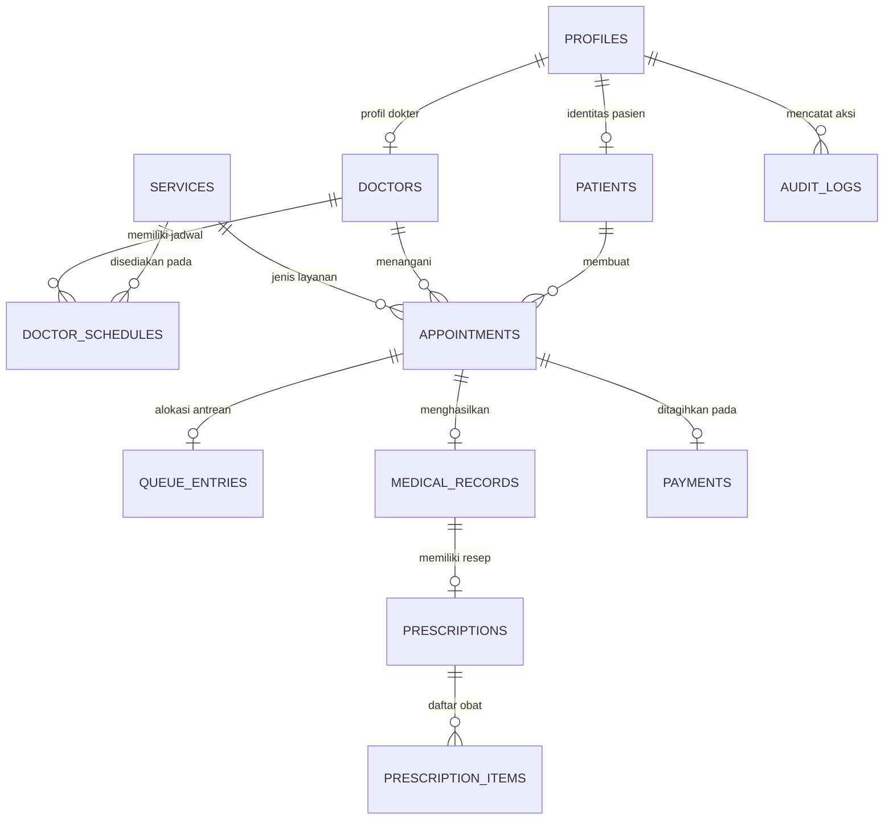
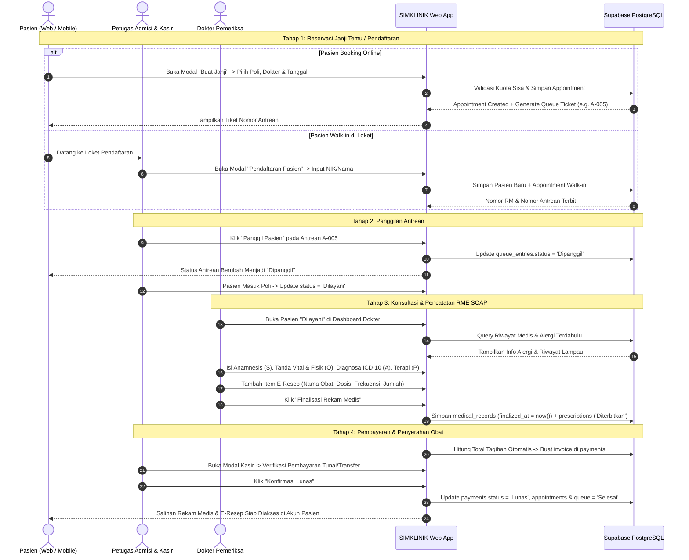

# Desain Arsitektur & Spesifikasi Realisasi MVP SIMKLINIK
**Tanggal:** 26 September 2026  
**Status:** Disetujui (Approved for Implementation)  
**Dokumen Induk:** [PRD.md](../PRD.md)  
**Arsitektur Target:** Modular Service-Layer Pattern (Vanilla ES6+ & Supabase PostgreSQL RLS)

---

## 1. Ringkasan Eksekutif & Tujuan

Spesifikasi desain ini mendefinisikan transformasi teknis Sistem Informasi Manajemen Klinik (**SIMKLINIK**) dari status antarmuka data tiruan (*mock data*) menjadi sistem operasional persisten yang terhubung ke **Supabase (PostgreSQL)** secara aman dan mematuhi **Permenkes No. 24 Tahun 2022** tentang Rekam Medis Elektronik (RME) serta **UU No. 27 Tahun 2022** tentang Perlindungan Data Pribadi (PDP).

### Tujuan Utama Realisasi:
1. **Migrasi Database Relasional Persisten:** Membangun dan mengaktifkan 12 tabel basis data di Supabase dengan generator sequence nomor otomatis (`No. RM`, `No. Resep`, `No. Invoice`) dan kebijakan *Row Level Security* (RLS) 100%.
2. **Modular Service Layer Frontend:** Memisahkan seluruh query data ke dalam direktori modul `assets/js/services/` tanpa ada kode query database yang menumpuk di file HTML atau tampilan.
3. **Antarmuka Interaktif Berbasis Modal:** Mengintegrasikan form pendaftaran, pembuatan janji temu pasien, formulir SOAP RME dokter, penerbitan e-resep multi-obat, dan pembayaran kasir menggunakan modal responsif tanpa reload halaman.
4. **Pencegahan Error & Idempotency:** Menjamin tidak ada klik ganda (*double booking* atau *double payment*) serta validasi batas kuota harian dokter.

---

## 2. Arsitektur Sistem & Struktur Berkas

Sistem mempertahankan arsitektur *static-first web client* yang ringan dan cepat tanpa overhead bundler, dengan struktur folder terorganisir:

```text
SIMklinik/
├── index.html                           # Landing page publik & informasi layanan klinik
├── login.html                           # Portal autentikasi multi-role (Google OAuth & username/pass)
├── pasien.html                          # Workspace shell dashboard pasien
├── dokter.html                          # Workspace shell dashboard dokter
├── petugas.html                         # Workspace shell dashboard petugas admisi & kasir
├── assets/
│   ├── css/
│   │   ├── landing.css                  # Stylesheet terdedikasi landing page
│   │   ├── auth.css                     # Stylesheet login, register, lockout
│   │   ├── dashboard.css                # Layout dashboard bersama (sidebar, topbar, grid, status badge)
│   │   ├── role-pages.css               # Komponen spesifik halaman fitur
│   │   └── modal.css                    # Styling modal popup, slide-over dialog, dan form inputs
│   └── js/
│       ├── landing.js                   # Interaksi mobile menu & smooth scroll landing page
│       ├── auth/
│       │   └── login.js                 # Handler login, Google SSO, rate limiter lockout
│       ├── components/
│       │   ├── modal.js                 # Helper modul dialog (open, close, focus-trap, ESC listener)
│       │   └── toast.js                 # Notifikasi toast mengambang (Sukses, Warning, Gagal)
│       ├── services/
│       │   ├── patientService.js        # API profil pasien, pencarian NIK/No.RM, registrasi baru
│       │   ├── appointmentService.js    # API jadwal dokter, cek kuota, booking janji temu
│       │   ├── queueService.js          # API antrean loket, pemanggilan status, nomor antrean
│       │   ├── medicalRecordService.js  # API catatan medis format SOAP & vital signs
│       │   ├── prescriptionService.js   # API e-resep multi-item dan aturan minum obat
│       │   └── billingService.js        # API kalkulasi tagihan kasir & konfirmasi bayar
│       └── dashboard/
│           ├── role-dashboard.js        # Controller render live data ke tabel dan stats card
│           └── router.js                # Session guard & role routing URL
├── config/
│   ├── supabase.js                      # Inisialisasi Supabase Client SDK
│   └── supabase-complete-schema.sql     # Skema DDL lengkap 12 tabel, trigger, sequence, dan RLS
└── docs/
    ├── ARCHITECTURE.md                  # Pedoman arsitektur dasar
    ├── PRD.md                           # Product Requirements Document resmi
    └── superpowers/specs/               # Spesifikasi desain & implementasi
```

---

## 3. Skema Basis Data & Kebijakan Keamanan (PostgreSQL Supabase)

### 3.1 Diagram Hubungan Entitas (ERD)



### 3.2 Spesifikasi Kolom Tabel
1. **`profiles`**
   - `id`: UUID (PK, references `auth.users(id)` ON DELETE CASCADE)
   - `full_name`: TEXT NOT NULL
   - `username`: TEXT UNIQUE NOT NULL
   - `role`: TEXT NOT NULL CHECK (role IN ('Pasien', 'Dokter', 'Petugas', 'Perawat', 'Admin', 'Kasir/Resepsionis'))
   - `created_at`: TIMESTAMPTZ DEFAULT now()

2. **`patients`**
   - `id`: UUID PRIMARY KEY DEFAULT gen_random_uuid()
   - `profile_id`: UUID REFERENCES profiles(id) ON DELETE CASCADE
   - `no_rm`: TEXT UNIQUE NOT NULL (Default via sequence: `RM-000001`)
   - `nik`: TEXT
   - `birth_date`: DATE
   - `gender`: TEXT CHECK (gender IN ('Laki-laki', 'Perempuan'))
   - `blood_type`: TEXT CHECK (blood_type IN ('A', 'B', 'AB', 'O', '-'))
   - `allergies`: TEXT
   - `phone`: TEXT
   - `emergency_contact`: TEXT
   - `emergency_phone`: TEXT
   - `created_at`: TIMESTAMPTZ DEFAULT now()

3. **`doctors`**
   - `id`: UUID PRIMARY KEY DEFAULT gen_random_uuid()
   - `profile_id`: UUID REFERENCES profiles(id) ON DELETE CASCADE
   - `sip_number`: TEXT UNIQUE NOT NULL
   - `specialization`: TEXT NOT NULL
   - `is_active`: BOOLEAN DEFAULT true
   - `created_at`: TIMESTAMPTZ DEFAULT now()

4. **`services`**
   - `id`: UUID PRIMARY KEY DEFAULT gen_random_uuid()
   - `code`: TEXT UNIQUE NOT NULL (e.g. `POLI_UMUM`, `POLI_GIGI`, `POLI_ANAK`, `LAB`)
   - `name`: TEXT NOT NULL
   - `base_price`: NUMERIC NOT NULL CHECK (base_price >= 0)
   - `is_active`: BOOLEAN DEFAULT true

5. **`doctor_schedules`**
   - `id`: UUID PRIMARY KEY DEFAULT gen_random_uuid()
   - `doctor_id`: UUID REFERENCES doctors(id) ON DELETE CASCADE
   - `service_id`: UUID REFERENCES services(id) ON DELETE CASCADE
   - `day_of_week`: INT CHECK (day_of_week BETWEEN 1 AND 7) (1 = Senin, 7 = Minggu)
   - `start_time`: TIME NOT NULL
   - `end_time`: TIME NOT NULL
   - `quota`: INT NOT NULL CHECK (quota > 0)

6. **`appointments`**
   - `id`: UUID PRIMARY KEY DEFAULT gen_random_uuid()
   - `patient_id`: UUID REFERENCES patients(id) ON DELETE RESTRICT
   - `doctor_id`: UUID REFERENCES doctors(id) ON DELETE RESTRICT
   - `service_id`: UUID REFERENCES services(id) ON DELETE RESTRICT
   - `appointment_date`: DATE NOT NULL
   - `appointment_time`: TIME NOT NULL
   - `chief_complaint`: TEXT NOT NULL
   - `status`: TEXT NOT NULL DEFAULT 'Terjadwal' CHECK (status IN ('Terjadwal', 'Dipanggil', 'Dilayani', 'Selesai', 'Dibatalkan'))
   - `created_at`: TIMESTAMPTZ DEFAULT now()
   - *Constraint:* `UNIQUE(doctor_id, appointment_date, appointment_time)` (Pencegahan tabrakan jam dokter)

7. **`queue_entries`**
   - `id`: UUID PRIMARY KEY DEFAULT gen_random_uuid()
   - `appointment_id`: UUID REFERENCES appointments(id) ON DELETE CASCADE
   - `queue_number`: TEXT NOT NULL (e.g. `A-001`, `B-002`)
   - `sequence_num`: INT NOT NULL
   - `status`: TEXT NOT NULL DEFAULT 'Menunggu' CHECK (status IN ('Menunggu', 'Dipanggil', 'Dilayani', 'Selesai', 'Batal'))
   - `called_at`: TIMESTAMPTZ
   - `created_at`: TIMESTAMPTZ DEFAULT now()

8. **`medical_records` (Format SOAP Kemenkes RI)**
   - `id`: UUID PRIMARY KEY DEFAULT gen_random_uuid()
   - `appointment_id`: UUID REFERENCES appointments(id) ON DELETE RESTRICT
   - `patient_id`: UUID REFERENCES patients(id) ON DELETE RESTRICT
   - `doctor_id`: UUID REFERENCES doctors(id) ON DELETE RESTRICT
   - `subjective`: TEXT NOT NULL (Anamnesis & Keluhan utama)
   - `vital_signs`: JSONB DEFAULT '{"systolic": 120, "diastolic": 80, "heart_rate": 75, "temperature": 36.5, "weight": 60, "height": 165}'::jsonb
   - `objective`: TEXT NOT NULL (Pemeriksaan fisik)
   - `diagnosis_icd10`: TEXT NOT NULL (Kode ICD-10 & deskripsi)
   - `assessment`: TEXT (Kesimpulan klinis)
   - `treatment_plan`: TEXT NOT NULL (Rencana terapi & edukasi)
   - `finalized_at`: TIMESTAMPTZ (Jika terisi, record terkunci)
   - `created_at`: TIMESTAMPTZ DEFAULT now()

9. **`prescriptions` & `prescription_items`**
   - `prescriptions.id`: UUID PRIMARY KEY DEFAULT gen_random_uuid()
   - `prescriptions.medical_record_id`: UUID REFERENCES medical_records(id) ON DELETE CASCADE
   - `prescriptions.prescription_number`: TEXT UNIQUE NOT NULL
   - `prescriptions.status`: TEXT NOT NULL DEFAULT 'Draft' CHECK (status IN ('Draft', 'Diterbitkan', 'Disiapkan', 'Selesai'))
   - `prescriptions.notes`: TEXT
   - `prescription_items.id`: UUID PRIMARY KEY DEFAULT gen_random_uuid()
   - `prescription_items.prescription_id`: UUID REFERENCES prescriptions(id) ON DELETE CASCADE
   - `prescription_items.medicine_name`: TEXT NOT NULL
   - `prescription_items.dosage`: TEXT NOT NULL
   - `prescription_items.frequency`: TEXT NOT NULL
   - `prescription_items.instructions`: TEXT NOT NULL (e.g. "Sesudah makan")
   - `prescription_items.quantity`: INT NOT NULL CHECK (quantity > 0)

10. **`payments`**
    - `id`: UUID PRIMARY KEY DEFAULT gen_random_uuid()
    - `appointment_id`: UUID REFERENCES appointments(id) ON DELETE RESTRICT
    - `invoice_number`: TEXT UNIQUE NOT NULL
    - `total_amount`: NUMERIC NOT NULL CHECK (total_amount >= 0)
    - `payment_method`: TEXT CHECK (payment_method IN ('Tunai', 'Transfer', 'QRIS'))
    - `status`: TEXT NOT NULL DEFAULT 'Menunggu' CHECK (status IN ('Menunggu', 'Lunas', 'Dibatalkan'))
    - `paid_at`: TIMESTAMPTZ
    - `created_at`: TIMESTAMPTZ DEFAULT now()

11. **`audit_logs`**
    - `id`: UUID PRIMARY KEY DEFAULT gen_random_uuid()
    - `user_id`: UUID REFERENCES auth.users(id)
    - `action`: TEXT NOT NULL
    - `table_name`: TEXT NOT NULL
    - `record_id`: TEXT NOT NULL
    - `old_values`: JSONB
    - `new_values`: JSONB
    - `created_at`: TIMESTAMPTZ DEFAULT now()

### 3.3 Kebijakan Row Level Security (RLS)
* **`profiles`:** User terautentikasi dapat membaca dan mengedit profil dirinya sendiri (`auth.uid() = id`). Dokter dan Petugas dapat membaca data profil pasien untuk keperluan klinis dan loket.
* **`patients`:** Pasien dapat membaca data dirinya sendiri (`profile_id = auth.uid()`). Petugas memiliki akses SELECT dan INSERT untuk seluruh pasien. Dokter memiliki akses SELECT untuk pasien yang memiliki janji temu dengan dokter bersangkutan.
* **`appointments`:** Pasien dapat INSERT dan SELECT janji temu miliknya. Dokter dapat membaca janji temu miliknya (`doctor_id`). Petugas dapat membaca dan memperbarui status seluruh janji temu.
* **`medical_records`:** Pasien hanya dapat membaca rekam medis miliknya yang sudah difinalisasi (`finalized_at IS NOT NULL`). Dokter dapat INSERT dan UPDATE rekam medis pasien yang diperiksanya. Pasca `finalized_at` terisi, UPDATE dilarang.
* **`prescriptions` & `prescription_items`:** Pasien dapat membaca resep berstatus `Diterbitkan` atau `Selesai` miliknya. Dokter dapat membuat dan mengedit resep pasiennya. Petugas dapat membaca untuk persiapan obat di apotek.
* **`payments`:** Pasien dapat membaca invoice miliknya. Petugas dapat membuat dan memvalidasi pembayaran menjadi `Lunas`.

---

## 4. Spesifikasi Modul Layanan Frontend (`assets/js/services/`)

Semua modul service ditulis dalam Vanilla JavaScript ES6+ modular dan mengekspos fungsi-fungsi asynchronous murni.

### 4.1 `patientService.js`
- `getCurrentPatient()`: Mengambil row pasien berdasarkan user auth aktif.
- `updatePatientProfile(patientId, fields)`: Memperbarui golongan darah, alergi, dan kontak darurat.
- `searchPatients(searchTerm)`: Menjalankan query `ilike` pada kolom `nik`, `no_rm`, atau `profiles.full_name`.
- `registerWalkinPatient(formData)`: Mendaftarkan pasien walk-in dan otomatis menghasilkan `no_rm`.

### 4.2 `appointmentService.js`
- `getDoctorSchedulesByService(serviceId)`: Mengambil daftar dokter aktif beserta hari/jam praktiknya.
- `checkQuotaAvailability(doctorId, appointmentDate)`: Memeriksa apakah kuota slot pada tanggal tersebut masih tersedia.
- `createAppointment(bookingData)`: Menyimpan data reservasi dan otomatis memicu pembuatan `queue_entries`.
- `getPatientAppointments(patientId)`: Mengambil daftar janji temu pasien (mendatang & riwayat).
- `getDoctorTodayAppointments(doctorId)`: Mengambil antrean pasien dokter hari ini.

### 4.3 `queueService.js`
- `getTodayQueue(serviceIdFilter)`: Mengambil daftar antrean aktif hari ini diurutkan berdasarkan `sequence_num`.
- `updateQueueStatus(queueId, newStatus)`: Mengubah status antrean (Dipanggil, Dilayani, Selesai, Batal).
- `callQueueAudio(queueNumber, poliName)`: Memutar notifikasi visual/suara panggilan antrean di loket.

### 4.4 `medicalRecordService.js`
- `getPatientHistory(patientId)`: Mengambil riwayat SOAP terdahulu untuk panduan dokter.
- `saveRecordDraft(appointmentId, soapData)`: Menyimpan draft rekam medis selama pemeriksaan berlangsung.
- `finalizeRecord(recordId, soapData)`: Menyimpan data final, membubuhkan timestamp `finalized_at`, dan mengunci dokumen.

### 4.5 `prescriptionService.js`
- `savePrescriptionWithItems(medicalRecordId, itemsArray, notes)`: Menyimpan master resep dan item rincian obat.
- `getPatientActiveMedicines(patientId)`: Mengambil daftar resep obat aktif untuk ditampilkan di tab Pasien.

### 4.6 `billingService.js`
- `getAppointmentBill(appointmentId)`: Mengakumulasikan biaya layanan poli + tindakan + obat.
- `confirmPayment(paymentId, paymentMethod)`: Mengubah status tagihan menjadi `Lunas`, mencatat waktu `paid_at`, dan memperbarui status antrean/kunjungan menjadi `Selesai`.

---

## 5. Alur Kerja Klinis Terintegrasi (End-to-End Clinic Workflow)



---

## 6. Antarmuka Modal Dialog Reusable (`assets/css/modal.css` & `assets/js/components/modal.js`)

Untuk memastikan pengguna tidak kehilangan konteks dashboard, seluruh dialog form menggunakan arsitektur modal seragam:

1. **Struktur DOM Modal:**
   - Backdrop semi-transparan dengan efek *backdrop-filter blur*.
   - Kotak modal terpusat dengan animasi *scale-in*.
   - Header modal dengan judul jelas dan tombol tutup (`✕`).
   - Body modal dengan layout form responsif (`grid`, form-groups, labels, validation messages).
   - Footer modal dengan tombol batal dan tombol submit utama dengan indikator loading spinner.
2. **Perilaku Aksesibilitas:**
   - Menjebak fokus (*focus trap*) di dalam modal saat aktif.
   - Menutup otomatis saat tombol `Escape` ditekan atau saat backdrop luar diklik.
   - Mengembalikan fokus keyboard ke tombol pemicu saat modal ditutup.
3. **Pemberitahuan Toast (`toast.js`):**
   - Menampilkan umpan balik visual instan di pojok kanan atas dengan tipe:
     - `toast.success(message)` (Hijau)
     - `toast.error(message)` (Merah)
     - `toast.info(message)` (Biru)

---

## 7. Rencana Verifikasi & Strategi Pengujian

Fitur dinyatakan tuntas hanya jika telah lolos verifikasi komprehensif berikut:

1. **Uji DDL Database & RLS:**
   - Seluruh 12 tabel terbentuk di Supabase tanpa error sintaks.
   - Sequence No. RM berurutan: `RM-000001`, `RM-000002`.
   - Foreign key constraint mencegah penghapusan data pasien yang memiliki riwayat rekam medis.
   - Uji RLS negatif: User Pasien A mencoba query langsung ke `medical_records` milik Pasien B dan diverifikasi ditolak oleh PostgreSQL.
2. **Uji Alur Bisnis Positif:**
   - Pasien berhasil booking janji temu mandiri; kuota dokter berkurang 1.
   - Antrean muncul seketika di layar loket Petugas.
   - Dokter dapat memanggil pasien, mengisi vital signs & SOAP, serta menerbitkan e-resep.
   - Kasir dapat menyelesaikan pembayaran, dan antrean otomatis ditandai *Selesai*.
   - Pasien dapat melihat hasil diagnosa dan instruksi minum obat di portalnya.
3. **Uji Penanganan Kondisi Khusus:**
   - Form submission saat koneksi offline menampilkan pesan error ramah pengguna (tidak crash).
   - Tombol booking dinonaktifkan saat kuota dokter penuh.
   - Tombol submit tidak dapat diklik ganda selama proses asinkron berlangsung (*idempotent*).
4. **Audit Kode:**
   - Nol kode CSS inline di file HTML.
   - Nol manipulasi `.style` di berkas JavaScript.
   - Tampilan responsif sempurna di perangkat Mobile (360px) hingga Desktop (1920px).

---

*Dokumen ini merupakan spesifikasi resmi pengembangan dan realisasi fitur SIMKLINIK MVP.*
