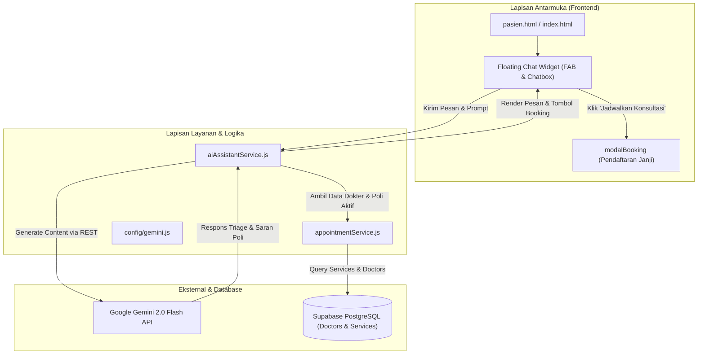

# Desain Spesifikasi Teknis: Asisten Cerdas Pasien SIMKLINIK (Gemini 2.0 Flash)
**Tanggal:** 01 Oktober 2026  
**Status:** Menunggu Persetujuan (Pending Approval)  
**Dokumen Induk:** [PRD.md](../../PRD.md)  
**Arsitektur Target:** Vanilla ES6+ Modular, Google Gemini 2.0 Flash REST API, Supabase Database Context, Zero-Dependency

---

## 1. Ringkasan & Tujuan

Dokumen spesifikasi ini mendefinisikan perancangan teknis implementasi **Asisten Cerdas Pasien (AI Patient Copilot)** untuk **SIMKLINIK**. Asisten AI ini menggunakan model **Google Gemini 2.0 Flash** untuk membantu pasien dalam:
1. **Pengecekan Gejala Awal & Smart Triage:** Pasien dapat menyampaikan keluhan fisik dengan bahasa alami sehari-hari; AI mengklasifikasi tingkat urgensi (Aman / Perlu Konsultasi Dokter / Darurat Gawat UGD).
2. **Rekomendasi Poliklinik & Dokter Presisi:** AI merekomendasikan poli spesialis dan dokter yang sesuai berdasarkan katalog layanan dan dokter aktif di klinik.
3. **Pintasan Booking Janji Temu (Actionable CTA Bridge):** Tautan/tombol interaktif di dalam chat yang langsung membuka modal booking (`modalBooking`) dengan poli yang telah otomatis terisi (*pre-selected*).
4. **Informasi Operasional Klinik:** Menjawab pertanyaan seputar jadwal praktik dokter, alur berobat, dan persiapan konsultasi.
5. **Kepatuhan Medikolegal & Keamanan:** Disclaimer medis otomatis sesuai standar etika kedokteran dan regulasi Permenkes No. 24/2022 & UU PDP No. 27/2022.

---

## 2. Arsitektur Sistem & Komponen



### 2.1 File & Struktur Baru:
1. `config/gemini.js`:
   * Konfigurasi endpoint Gemini 2.0 Flash REST API (`https://generativelanguage.googleapis.com/v1beta/models/gemini-2.0-flash:generateContent`).
   * Manajemen API Key yang aman dan fleksibel (disimpan di `localStorage` atau konfigurasi default dengan petunjuk pengaturan mudah bagi klinik).
2. `assets/js/services/aiAssistantService.js`:
   * Service orkestrator yang mengelola percakapan multi-turn (*conversation history*).
   * Injeksi konteks klinik dinamis (*dynamic system prompt*) berisi daftar layanan klinik aktif, nama-nama dokter, serta panduan triage klinis.
   * Parser respons AI untuk mendeteksi *action tag* (misalnya tombol pintasan reservasi poli).
3. `assets/css/ai-chat.css`:
   * Desain widget modern *Clean Clinical Tech*: tombol mengambang (*Floating Action Button / FAB*), jendela obrolan mengambang (*expandable chat drawer*), indikator animasi mengetik (*typing bubbles*), kartu rekomendasi poli, dan *quick-reply chips*.
4. `assets/js/components/aiChatWidget.js`:
   * Web component / modul UI vanilla yang me-render dan mengontrol interaksi widget chat, riwayat chat sesi, tombol buka/tutup, dan event listener pintasan modal booking.

---

## 3. Spesifikasi Fungsional AI & Prompt Engineering

### 3.1 Peran AI (*System Persona*)
AI bertindak sebagai **"Nayla - Asisten Medis Virtual SIMKLINIK"**:
* **Gaya Komunikasi:** Empatik, sopan, profesional, menenangkan, menggunakan Bahasa Indonesia yang ramah awam tanpa istilah medis rumit yang membingungkan.
* **Protokol Kegawatdaruratan (Emergency Protocol):**
  * Jika terdeteksi *red flags* medis (misal: nyeri dada menjalar ke lengan kiri, sesak napas berat, muntah darah, kehilangan kesadaran, cedera kepala berat):
  * AI **wajib** segera memberikan instruksi darurat: *"Gejala Anda mengindikasikan kondisi gawat darurat yang membutuhkan penanganan medis segera. Mohon segera menuju Instalasi Gawat Darurat (IGD) rumah sakit terdekat atau hubungi 118/119."*
* **Protokol Rekomendasi Poli & CTA Booking:**
  * Untuk keluhan non-darurat, AI memberikan analisis kemungkinan penyebab secara edukatif dan menyarankan poli terkait.
  * AI menyertakan format aksi khusus: `[BOOK_POLI: "Nama Poli"]`.
  * Widget chat akan mengubah token `[BOOK_POLI: ...]` menjadi tombol interaktif bergaya primer:
    `📅 Jadwalkan Konsultasi di [Nama Poli]`

### 3.2 Dynamic Context Injection
Sebelum percakapan dikirim ke Gemini, `aiAssistantService.js` mengambil data layanan aktif klinik dari database melalui `appointmentService.js`:
```javascript
const services = await appointmentService.getServices();
// Contoh: Poli Umum (dr. Budi), Poli Gigi (drg. Siti), Poli Anak (dr. Ratna, Sp.A)
```
Data ini dimasukkan ke dalam instruksi sistem sehingga AI tidak pernah merekomendasikan poli atau dokter yang tidak tersedia di klinik SIMKLINIK.

---

## 4. Spesifikasi Desain Antarmuka (UI/UX)

1. **Floating Action Button (FAB):**
   * Terletak di pojok kanan bawah (`bottom: 24px; right: 24px; z-index: 1000`).
   * Tombol bulat dengan ikon stetoskop/sparkle kecerdasan buatan dan status aktif berdenyut halus (*pulse dot*).
   * Dilengkapi teks label mini / badge: *"Tanya Asisten Medis"*.

2. **Chat Window (Jendela Obrolan):**
   * Ukuran: Desktop `380px x 560px`, Mobile responsif `full width/height bottom-sheet`.
   * **Header:** Avatar AI Nayla, nama & titel "Asisten Virtual SIMKLINIK", indikator hijau "Aktif", tombol minimize, tombol clear chat.
   * **Disclaimer Bar:** Pesan singkat: *"AI memberikan panduan awal edukatif & bukan pengganti diagnosis resmi dokter."*
   * **Quick Prompt Chips (Pintasan Cepat):**
     * 🩺 *"Cek Gejala Saya"*
     * 👨‍⚕️ *"Jadwal Dokter Hari Ini"*
     * 🏥 *"Alur Pendaftaran Pasien"*
   * **Message Bubbles:**
     * User bubble: Latar biru/teal gelap, teks putih, rata kanan.
     * AI bubble: Latar putih bersih dengan border halus, avatar AI, teks terformat rapi dengan dukungan markdown (bold, bullet list).
   * **Interactive Action Card:** Tombol khusus di dalam respons AI untuk langsung membuka modal pendaftaran janji temu.
   * **Input Bar:** Kotak ketik fleksibel dengan placeholder *"Tulis keluhan atau pertanyaan Anda..."*, tombol kirim, dan dukungan tombol `Enter` untuk mengirim pesan.

---

## 5. Keamanan & Penanganan API Key

1. **Manajemen Kredensial Gemini 2.0:**
   * Di file `config/gemini.js`, kunci API dapat dikonfigurasi melalui:
     - Kunci default klinik (jika disematkan).
     - Pengaturan modal API Key di sisi pengguna/admin (disimpan di `localStorage` per peramban).
   * Jika API Key belum terpasang, chat widget menampilkan sambutan ramah dengan tombol *"Atur Kunci API Gemini"* yang memandu pengguna mendapatkan kunci gratis dari Google AI Studio.
2. **Isolasi Data Pribadi:**
   * Tidak ada data identitas sensitif (seperti NIK, alamat lengkap, nomor telepon pasien) yang dikirimkan ke model AI. Hanya deskripsi keluhan dan riwayat percakapan sesi yang diteruskan untuk keperluan analisis medis.

---

## 6. Verifikasi & Pengujian Kualitas

1. **Uji Skenario Gejala Ringan:**
   * Input: *"Gigi geraham kanan saya ngilu kalau minum air dingin sejak 2 hari lalu."*
   * Ekspektasi: AI menduga sensitivitas gigi atau karies, menyarankan **Poli Gigi**, dan tombol booking Poli Gigi muncul. Klik tombol membuka modal booking dengan poli gigi terpilih.
2. **Uji Skenario Kegawatdaruratan (Red Flag):**
   * Input: *"Dada kiri saya tiba-tiba sesak luar biasa seperti tertindih batu dan menjalar ke leher."*
   * Ekspektasi: AI langsung mengeluarkan peringatan kegawatdaruratan IGD darurat, tidak menyarankan booking poliklinik rawat jalan biasa.
3. **Uji Jadwal & Tanya Informasi:**
   * Input: *"Apakah ada dokter spesialis anak di klinik ini?"*
   * Ekspektasi: AI menyebutkan dokter anak sesuai data yang ada di database klinik.
4. **Uji Tampilan Responsif:**
   * Memastikan chat bubble dan window tampil sempurna di layar mobile (360px) tanpa menutupi navigasi dasar pasien.

---

*Spesifikasi ini dirancang agar dapat dilanjutkan pada Fase 2 (Asisten SOAP Dokter) dan Fase 3 (Asisten FAQ & Operasional Petugas) dengan menggunakan modul service AI yang sama.*
