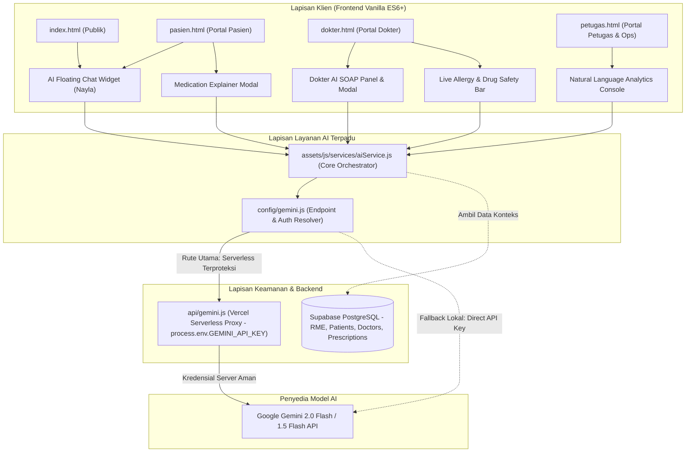

# Spesifikasi Desain Teknis: SIMKLINIK AI Clinical & Operational Suite
**Tanggal:** 01 Oktober 2026  
**Status:** Menunggu Persetujuan Pengguna (Pending User Approval)  
**Dokumen Terkait:** [PRD.md](../../PRD.md)  
**Model AI Utama:** Google Gemini 2.0 Flash / Gemini 1.5 Flash API  
**Target Arsitektur:** Hybrid Vercel Serverless Function + Client-Side Fallback, Vanilla ES6+ Modular, Supabase PostgreSQL Context, Zero-Dependency

---

## 1. Ringkasan Eksekutif & Tujuan

Dokumen ini merinci arsitektur, spesifikasi teknis, skema data, dan alur antarmuka untuk **SIMKLINIK AI Suite** — rangkaian modul kecerdasan buatan terpadu yang dirancang khusus untuk memenuhi kebutuhan tiga pilar pemangku kepentingan klinik:

1. **Pasien (Patient-Facing AI):**
   - **Smart Triage & Asisten Pemilihan Poli:** Triage keluhan alami pasien (🟢 Ringan, 🟡 Sedang, 🔴 Darurat UGD), rekomendasi poli spesialis dan dokter bertugas, tombol pintasan otomatisasi reservasi (`[BOOK_POLI: "Poli Umum"]`), dan disclaimer medikolegal otomatis.
   - **AI Medication Explainer:** Menerjemahkan signa resep medis/latin (misal: *Amoxicillin 500mg 3x1 a.c. habiskan*) menjadi bahasa awam yang ramah, disertai anjuran diet, pantangan, dan gaya hidup sehat.
2. **Dokter (Doctor's Co-Pilot / Clinical Assistant):**
   - **AI Ambient SOAP Generator:** Mengubah catatan keluhan mentah dokter atau hasil transkrip percakapan menjadi format rekam medis terstruktur sesuai standar **Permenkes No. 24 Tahun 2022** (Subjective, Objective, Assessment, Plan) lengkap dengan kodifikasi **ICD-10 WHO** otomatis.
   - **Safety Checker (Alergi & Interaksi Obat):** Melakukan validasi cerdas secara *real-time* saat dokter menyusun e-resep terhadap profil riwayat alergi pasien di Supabase dan potensi reaksi silang antar golongan obat (*drug cross-reactivity*).
3. **Petugas Admisi & Manajemen Klinik (Admin/Ops AI):**
   - **Chatbot FAQ Klinik 24/7:** Floating widget cerdas pada *landing page* dan portal publik yang dapat menjawab jadwal dokter hari ini, alur BPJS vs Pasien Umum, dan tarif tindakan dasar secara akurat menggunakan data riil dari Supabase.
   - **Natural Language Analytics (Tanya Data Klinik):** Antarmuka analitik bagi manajer/petugas untuk mengajukan pertanyaan operasional dalam bahasa sehari-hari (misal: *"Berapa pasien batuk minggu ini dibandingkan minggu lalu?"* atau *"Obat apa yang stoknya paling cepat habis?"*) dan menerima ringkasan metrik analitik yang akurat.

---

## 2. Arsitektur Sistem & Alur Data

### 2.1 Diagram Alur Arsitektur



### 2.2 Penjelasan Komponen

1. **`api/gemini.js` (Serverless Function Vercel):**
   - Berfungsi sebagai server proxy terbalik (*reverse proxy*).
   - Membaca `process.env.GEMINI_API_KEY` di server Vercel sehingga kunci API tidak bocor ke browser pasien/publik.
   - Menerima payload permintaan dari frontend, menambahkan `systemInstruction`, dan meneruskannya ke Google Generative Language API via HTTPS REST.

2. **`config/gemini.js` (Hybrid Connectivity & Client Configuration):**
   - Mendeteksi apakah rute serverless `/api/gemini` aktif dan merespons.
   - Jika berjalan di lingkungan hosting Vercel: Rute otomatis diarahkan ke `/api/gemini`.
   - Jika dijalankan di lingkungan lokal (*file://* atau server statis lokal tanpa Vercel CLI): Menggunakan kunci API yang tersimpan di `localStorage.getItem('gemini_api_key')`.
   - Menyediakan modal UI pengaturan API Key untuk memudahkan pengujian mandiri (*Quick API Key Setting Modal*).

3. **`assets/js/services/aiService.js` (Unified AI Service):**
   - Menyediakan 6 modul metode spesifik dengan *structured prompt engineering*:
     1. `triagePatient(complaint, history, clinicServices)`
     2. `explainMedications(prescriptionItems, diagnosis)`
     3. `generateSoapFromNotes(rawNotes, patientVitals)`
     4. `checkPrescriptionSafety(patientAllergies, medicinesToPrescribe)`
     5. `answerClinicFaq(userQuery, clinicContext)`
     6. `queryClinicalAnalytics(naturalQuery, clinicDatasetSummary)`

4. **`assets/js/components/aiChatWidget.js` & `assets/css/ai-chat.css`:**
   - Komponen web mengambang (*Floating Action Button + Chat Drawer*) bergaya *Clinical Glassmorphism Modern*.
   - Menyertakan chip pemicu cepat (*quick chips*), indikator animasi mengetik, render *markdown-lite* (bold, list), dan parser tombol aksi booking `[BOOK_POLI: "Nama Poli"]`.

---

## 3. Spesifikasi Fungsional Per Modul

### 3.1 Modul 1: Pasien (Patient-Facing AI)

#### A. Smart Triage & Pemilihan Poli
* **Tujuan:** Memandu pasien mengenali kegawatan gejala dan mengarahkan ke poliklinik yang tepat.
* **Tingkat Triage:**
  - 🟢 **Ringan (Mild/Home Care):** Gejala ringan tanpa komplikasi. AI menyarankan perawatan mandiri awal dan menawarkan opsi konsultasi poli umum/spesialis.
  - 🟡 **Sedang (Moderate/Clinic Visit):** Memerlukan evaluasi langsung oleh dokter dalam 24 jam. AI menyarankan poli spesialis terkait dan memunculkan tombol pintasan reservasi.
  - 🔴 **Darurat UGD (Emergency/Red Flag):** Gejala ancaman jiwa (misal: nyeri dada khas infark, sesak napas berat, perdarahan hebat, stroke symptoms). AI mengeluarkan peringatan kontras tinggi dan instruksi segera ke IGD/hubungi 119, serta menonaktifkan booking poli rawat jalan biasa.
* **Format Pintasan Aksi (CTA Action Tag):**
  - AI menghasilkan tag khusus: `[BOOK_POLI: "Poli Umum"]` atau `[BOOK_POLI: "Poli Gigi"]`.
  - Chat widget secara otomatis mengonversi tag ini menjadi tombol: `📅 Jadwalkan Janji Temu di Poli Umum`.
  - Klik pada tombol langsung menutup chat drawer dan membuka `modalBooking` dengan dropdown poli terisi otomatis.
* **Disclaimer Medis Otomatis:**
  Setiap percakapan diawali atau diakhiri dengan catatan:
  > *"Pemberitahuan Medis: Asisten AI Nayla memberikan panduan awal edukatif dan bukan pengganti diagnosis resmi dokter. Jika mengalami kondisi darurat, segera hubungi IGD terdekat."*

#### B. AI Medication Explainer
* **Tujuan:** Mengurai instruksi resep dokter dari terminologi farmasi latin ke instruksi sehari-hari yang mudah dipahami.
* **Integrasi:** Tombol *"✨ Tanya AI Penjelasan Obat"* pada kartu resep di `pasien.html` dan modal detail RME.
* **Output yang Dihasilkan:**
  1. *Fungsi Obat dalam Bahasa Sederhana* (Contoh: "Amoxicillin adalah antibiotik untuk membunuh kuman infeksi bakteri").
  2. *Jadwal & Cara Konsumsi* (Contoh: "Diminum 3 kali sehari tiap 8 jam, diminum sebelum makan").
  3. *Instruksi Khusus* (Contoh: "Harus dihabiskan seluruhnya meski tubuh sudah merasa sembuh agar kuman tidak kebal obat").
  4. *Pantangan Makanan & Anjuran Hidup Sehat* (Contoh: "Hindari minuman bersoda, perbanyak minum air hangat dan istirahat 7-8 jam").

---

### 3.2 Modul 2: Dokter (Doctor's Co-Pilot / Clinical Assistant)

#### A. AI Ambient SOAP Generator
* **Tujuan:** Mengurangi beban administrasi dokter dalam mengetik rekam medis SOAP Permenkes No. 24/2022.
* **Antarmuka di `dokter.html`:**
  - Ditambahkan panel accordion / kartu aksi: *"✨ AI Ambient SOAP Assistant"* pada bagian atas formulir di dalam `modalSoapRecord`.
  - Kotak input cepat: *"Catatan Mentah / Poin Pemeriksaan Dokter"* (dokter dapat mengetik atau menyalin transkrip percakapan lisan).
  - Tombol *"⚡ Format ke Standar SOAP Permenkes"*.
* **Proses Inferensi AI:**
  Gemini menerima input mentah + data tanda vital yang sudah ada, lalu mengembalikan objek JSON terstruktur:
  ```json
  {
    "subjective": "Pasien mengeluhkan demam tinggi sejak 4 hari...",
    "objective": "Pemeriksaan orofaring menunjukkan tonsil T2/T2 hiperemis...",
    "assessment": "Tonsilofaringitis Akut",
    "icd10": "J06.8",
    "plan": "Tirah baring, rehidrasi cairan cukup, pemberian analgesik & antibiotik..."
  }
  ```
* **Auto-Population:** Nilai JSON otomatis mengisi input form `soapSubjective`, `soapObjective`, `soapAssessment`, `soapIcd10`, dan `soapPlan`. Dokter tetap memegang kendali penuh untuk meninjau dan mengedit sebelum finalisasi.

#### B. Safety Checker (Peringatan Alergi & Interaksi Obat)
* **Tujuan:** Mencegah terjadinya kejadian tidak diharapkan (*adverse drug events*) saat dokter meresepkan obat.
* **Mekanisme Pengecekan:**
  - Saat dokter mengetik atau menambahkan nama obat pada tabel e-resep di modal SOAP, sistem mengambil data `allergies` pasien dari database Supabase (`patients.allergies`).
  - AI Safety Checker menganalisis kombinasi obat terhadap riwayat alergi dan potensi interaksi silang.
  - Jika terdeteksi risiko bahaya:
    - Muncul bar peringatan warna kuning/merah:
      > ⚠️ *"Peringatan Keamanan Obat: Pasien memiliki riwayat alergi Amoxicillin (Golongan Penisilin). Obat Cefadroxil (Sefalosporin) yang dipilih memiliki potensi reaksi silang alergi ~10%. Pertimbangkan antibiotik alternatif non-beta-laktam."*

---

### 3.3 Modul 3: Petugas & Manajemen Klinik (Admin/Ops AI)

#### A. Chatbot FAQ Klinik 24/7
* **Tujuan:** Mengurangi beban kerja loket pendaftaran untuk pertanyaan-pertanyaan berulang.
* **Penempatan:** Floating chat widget pada halaman landing publik (`index.html`) dan portal antrean.
* **Sumber Data Konteks:**
  - Mengambil data live poliklinik dan jadwal dokter aktif dari Supabase (`doctors`, `services`).
  - Informasi operasional klinik: Jam buka, alur pendaftaran BPJS Kesehatan (syarat rujukan Faskes 1, KTP/KIS) vs Pasien Umum, estimasi tarif konsultasi dan pembayaran (Tunai, QRIS, Transfer).

#### B. Natural Language Analytics (Tanya Data Klinik)
* **Tujuan:** Memudahkan manajer klinik dan petugas menganalisis data operasional tanpa perlu menulis kueri SQL manual.
* **Antarmuka di `petugas.html`:**
  - Ditambahkan bilah interaktif: *"🤖 Tanya Data Klinik (AI Analytics Console)"*.
  - Contoh pertanyaan cepat (chip):
    - *"Berapa pasien yang berkunjung minggu ini?"*
    - *"Apa diagnosa terbanyak bulan ini?"*
    - *"Bagaimana perbandingan pasien BPJS vs Umum?"*
* **Alur Logika:**
  - Frontend mengirim kueri bahasa alami + ringkasan data agregat aman (jumlah antrean harian, top diagnosa, status pembayaran) ke `aiService.queryClinicalAnalytics()`.
  - AI menyusun ringkasan eksekutif, angka perbandingan (*key metrics*), serta rekomendasi tindakan manajerial.

---

## 4. Keamanan, Etika Medis & Regulasi

1. **Kepatuhan UU PDP No. 27/2022 (Perlindungan Data Pribadi):**
   - Data identitas sensitif seperti Nomor Induk Kependudukan (NIK 16 digit), nomor telepon, dan nomor rekening perbankan **tidak pernah** dikirimkan ke model AI.
   - Pengecekan medis hanya mengirimkan data klinis non-identitas (keluhan, tanda vital, usia, jenis kelamin, nama obat).
2. **Kepatuhan Permenkes No. 24/2022:**
   - Hasil olahan AI pada SOAP hanya bersifat rekomendasi draft (*Doctor in the Loop*). Keputusan akhir, revisi, dan penguncian mutlak tetap berada di tangan dokter penanggung jawab pelayanan (DPJP) yang memiliki Surat Tanda Registrasi (STR) dan Surat Izin Praktik (SIP).
3. **Perlindungan Kredensial API:**
   - Di production, API Key hanya disimpan di environment variable Vercel (`GEMINI_API_KEY`).
   - Di lingkungan lokal, API Key disimpan di `localStorage` per peramban dan tidak pernah di-commit ke Git.

---

## 5. Rencana Pengujian & Kriteria Keberhasilan

| Modul | Skenario Uji | Ekspektasi Hasil |
|---|---|---|
| **Smart Triage (Pasien)** | Pasien mengeluh: *"Dada sakit seperti terhimpit dan sesak napas berat"* | AI mendeteksi status **Darurat UGD**, mengarahkan ke IGD 119, dan **tidak** memunculkan tombol booking rawat jalan biasa. |
| **Smart Triage (Pasien)** | Pasien mengeluh: *"Gigi geraham belakang ngilu bila minum es"* | AI mengidentifikasi keluhan gigi, menyarankan Poli Gigi, dan tombol `[Jadwalkan Konsultasi Poli Gigi]` muncul & berfungsi. |
| **Medication Explainer** | Resep: *"Cefixime 200mg 2x1 d.c. habiskan"* | Diterjemahkan ke bahasa awam: antibiotik diminum 2 kali sehari bersama makan, wajib dihabiskan. |
| **SOAP Generator (Dokter)** | Input dokter: *"Px dtg batuk 3 hr dahak putih, demam +, ronki -/-, faring hiperemis, tx amox + pct"* | Terkonversi lengkap ke format Subjective, Objective, Assessment (Faringitis/ISPA + ICD-10 J06.9), dan Plan yang rapi di form modal. |
| **Safety Checker (Dokter)** | Pasien alergi *"Penisilin"*, dokter meresepkan *"Amoxicillin 500mg"* | Peringatan bahaya merah segera muncul di atas tabel resep. |
| **FAQ Klinik (Publik)** | Pengunjung bertanya: *"Bagaimana alur pendaftaran BPJS di klinik ini?"* | AI menjelaskan langkah: bawa KTP/KIS, pastikan faskes 1 sesuai, ambil nomor antrean loket BPJS. |
| **NL Analytics (Petugas)** | Petugas bertanya: *"Bagaimana tren kunjungan pasien minggu ini?"* | AI menganalisis data antrean yang dimuat dan menyajikan ringkasan persentase dan tren. |

---

*Dokumen ini siap ditinjau dan disetujui untuk kemudian dijabarkan menjadi Rencana Eksekusi Langkah-demi-Langkah (Implementation Plan).*
