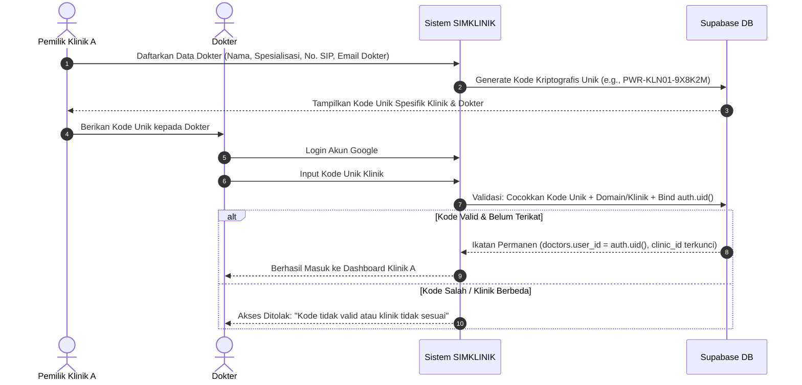
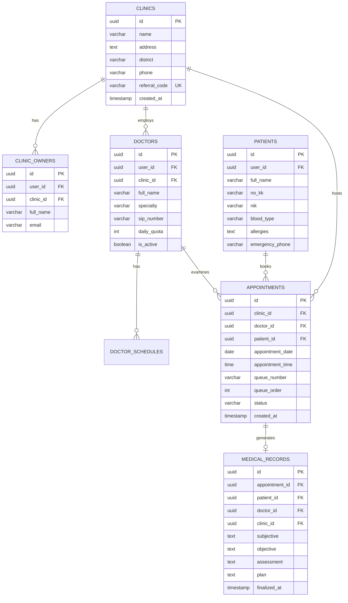

# Desain Spesifikasi Teknis: SIMKLINIK Multi-Tenant Regional (Purworejo, Jawa Tengah)
**Tanggal:** 06 Oktober 2026  
**Status:** Menunggu Persetujuan (Pending Review & Approval)  
**Judul Penelitian:** *Pengembangan Aplikasi Klinik, Penjadwalan Dokter, Manajemen Antrean, Registrasi Pasien*  
**Platform Target:** Web & Mobile Responsive, Multi-Tenant Architecture, Google Gemini 2.0 Flash AI Copilot, Supabase PostgreSQL RLS

---

## 1. Ringkasan Eksekutif & Visi Perombakan Sistem

Perombakan arsitektur ini mentransformasikan **SIMKLINIK** menjadi sebuah **Platform Agregator Layanan Klinik Multi-Tenant Regional** yang berfokus pada fasilitas kesehatan mandiri dan pratama di wilayah **Kabupaten Purworejo, Jawa Tengah** (mencakup kecamatan Purworejo Kota, Kutoarjo, Banyuurip, Bayan, dan sekitarnya).

Sistem ini mempertemukan dan mengintegrasikan 3 peran pengguna:
1. **Pemilik Klinik (Tenant Admin):** Mengelola entitas klinik, jam operasional, pendaftaran dokter, serta memiliki kode unik otentikasi klinik dengan keamanan tinggi.
2. **Dokter (Tenaga Medis):** Mengakses dashboard klinik menggunakan login Google dan kode unik klinik terverifikasi, memantau antrean live pasien hari ini, mengisi RME (Rekam Medis Elektronik format SOAP) yang aktif otomatis saat giliran pasien tiba, serta alur antrean sekuensial yang otomatis memuat template pasien berikutnya setelah RME diselesaikan.
3. **Pasien (Masyarakat):** Mengakses katalog klinik Purworejo, berkonsultasi dengan AI Chatbot yang paham situasi antrean & kuota dokter klinik secara *real-time*, melengkapi data rekam diri (No. KK, Golongan Darah, Alergi), melakukan reservasi kuota dokter dengan proteksi aturan pembatalan 12 jam, memantau antrean *live*, serta meninjau riwayat RME pasca pemeriksaan.

---

## 2. Arsitektur Keamanan: Kode Unik Otentikasi Dokter Anti-Salah Masuk

Untuk menjamin agar **tidak ada dokter yang salah masuk ke klinik lain**, sistem menerapkan mekanisme otentikasi bertingkat (*Cryptographic Strict Binding*):



### Spesifikasi Kode Unik:
1. **Format Entropi Tinggi:** Format terdiri dari: `PWR-[PREFIX_KLINIK]-[RANDOM_ALPHANUMERIC_6_CHARS]` (Contoh: `PWR-SEHAT-X7K9M2`). Menggunakan karakter huruf kapital dan angka tanpa karakter ambigu (`0`, `O`, `1`, `I`).
2. **Kekuatan Unik di Database:** Kolom `referral_code` pada tabel `clinics` memiliki constraint `UNIQUE`, `NOT NULL`, dan `INDEX`.
3. **Cross-Check Validasi Dokter:**
   * Di tabel `doctors`, pemilik klinik terlebih dahulu mendaftarkan dokter yang diakui.
   * Saat dokter memasukkan kode unik pada saat login pertama kali, sistem mencocokkan akun Google dengan profil dokter di klinik tersebut.
   * Setelah diverifikasi, `doctors.user_id` dikunci secara permanen ke `auth.uid()`. Dokter tersebut **tidak akan pernah bisa mengakses klinik lain** kecuali memiliki mandat resmi dari pemilik klinik bersangkutan.
4. **Proteksi Brute-Force:** Percobaan salah memasukkan kode lebih dari 3 kali akan mengunci formulir kode selama 15 menit.

---

## 3. Spesifikasi Alur 3 Peran Pengguna (*User Journeys*)

### 3.1 Portal Masuk & Otentikasi (`login.html`)
Layar login menyediakan 3 opsi peran yang jelas:
* **Tab 1: Pasien**
  * Tombol Google Sign-In $\rightarrow$ pengisian Username & Password bagi akun baru $\rightarrow$ diarahkan ke `pasien.html`.
* **Tab 2: Dokter**
  * Tombol Google Sign-In $\rightarrow$ formulir input **Kode Unik Klinik** $\rightarrow$ verifikasi relasi dokter-klinik $\rightarrow$ diarahkan ke `dokter.html` khusus klinik tempatnya bertugas.
* **Tab 3: Pemilik Klinik**
  * Login akun kredensial pemilik $\rightarrow$ masuk ke dashboard administrasi klinik `pemilik.html`.

---

### 3.2 Alur Pasien (`pasien.html`)

1. **Beranda & Eksplorasi Klinik Purworejo:**
   * Menampilkan daftar klinik di Purworejo dengan filter kecamatan (Purworejo Kota, Kutoarjo, Banyuurip, Bayan, Loano, Gebang, dll).
   * Setiap kartu klinik menampilkan: Nama Klinik, Alamat, Jam Operasional, Status Keramaian Antrean Saat Ini (Rendah / Sedang / Ramai), dan Indikator Sisa Kuota Dokter Hari Ini.
2. **AI Chatbot Asisten Purworejo (Gemini 2.0 Flash):**
   * Pasien mengetik keluhan: *"Saya pusing berputar dan mual sejak tadi pagi di area Kutoarjo."*
   * **Injeksi Data Real-time:** AI membaca data database Supabase terkini (daftar klinik terdekat di Purworejo, dokter spesialis/umum yang sedang buka, sisa kuota, dan kepadatan antrean).
   * **Respons AI:** Memberikan panduan awal (*Triage*), merekomendasikan klinik & dokter di Purworejo, serta memberikan informasi antrean:
     > *"Berdasarkan gejala Anda, disarankan memeriksakan diri ke dokter umum. Di area Kutoarjo, **Klinik Pratama Sehat Mandiri** memiliki **dr. Budi** yang praktik hari ini dengan **sisa kuota 4 pasien (antrean saat ini sedang lengang: 2 orang)**."*
   * Menyediakan tombol pintas langsung di balon chat: `[📅 Buat Janji di Klinik Ini]`.
3. **Syarat Kelengkapan Data Diri Pasien (Onboarding Terpadu):**
   * Saat pasien mengklik tombol buat janji pada dokter yang dipilih, sistem mengecek kelengkapan data di profil pasien.
   * Jika belum lengkap, modal data diri otomatis meminta pengisian:
     * Nama Lengkap Sesuai KTP
     * Nomor Kartu Keluarga (KK) & NIK (16 digit)
     * Golongan Darah (A / B / AB / O)
     * Riwayat Alergi Obat / Makanan (atau isi "Tidak Ada")
     * Kontak Darurat & Nomor WhatsApp
4. **Pemesanan Kuota & Keterangan Aturan Pembatalan 12 Jam:**
   * Pasien memilih tanggal dan sesi jam praktik dokter yang kuotanya masih tersedia.
   * Teks peringatan wajib terlihat jelas sebelum konfirmasi:
     > ⚠️ *"Penting: Janji pemeriksaan hanya dapat dibatalkan maksimal 12 jam sebelum jadwal pemeriksaan. Pembatalan setelah batas waktu tersebut tidak diizinkan sistem."*
5. **Live Manajemen Antrean:**
   * Setelah booking berhasil, pasien mendapatkan **Nomor Tiket Antrean** (misal `A-05`).
   * Pasien dapat memantau pergerakan nomor antrean yang sedang dilayani dokter secara langsung dari aplikasi.
6. **Riwayat Kunjungan & RME Pasien:**
   * Menu riwayat menyajikan arsip seluruh klinik dan dokter yang pernah dikunjungi pasien di Purworejo beserta lembar rekam medis elektronik (RME) yang telah difinalisasi dokter.

---

### 3.3 Alur Dokter & Otomasi RME Sekuensial (`dokter.html`)

1. **Dashboard Pasien Hari Ini:**
   * Menampilkan daftar pasien berurutan berdasarkan nomor antrean pada hari praktik dokter bersangkutan.
2. **Aktivasi Template RME Otomatis:**
   * Saat jam operasional/sesi konsultasi tiba, dashboard dokter otomatis memunculkan **Template Formulir RME (SOAP)** untuk pasien nomor antrean pertama yang berstatus `menunggu`.
   * Template mencakup:
     * **S (Subjective):** Keluhan utama & riwayat sakit.
     * **O (Objective):** Tanda vital (Tensi darah, Nadi, Suhu, Pernapasan) & pemeriksaan fisik.
     * **A (Assessment):** Diagnosa klinis (ICD-10).
     * **P (Plan):** Rencana obat / resep & edukasi.
3. **Otomasi Alur Pasien Berikutnya (*Sequential Queue Shift*):**
   * Ketika dokter selesai memeriksa dan menekan tombol **"Selesai & Simpan RME"**:
     1. Status antrean pasien saat ini diperbarui menjadi `selesai`.
     2. Sistem menandai pemeriksaan telah rampung dan memindahkan pointer aktif ke nomor antrean berikutnya (`sedang_diperiksa`).
     3. Form RME otomatis dibersihkan dan langsung memuat identitas serta template RME pasien antrean berikutnya tanpa dokter perlu berpindah halaman manual!
4. **Aturan Pembatalan Janji (12 Jam Lock):**
   * Pasien maupun dokter memiliki tombol "Batalkan Janji".
   * Sistem menghitung selisih waktu: $\Delta t = \text{Waktu Janji} - \text{Waktu Sekarang}$.
   * Jika $\Delta t \ge 12 \text{ jam}$: Tombol berwarna **Merah Aktif** dan pembatalan diizinkan (kuota dokter dikembalikan).
   * Jika $\Delta t < 12 \text{ jam}$:
     * Tombol otomatis berubah menjadi **Abu-abu (Disabled / Terkunci)**.
     * Ketika diarahkan kursor atau diklik, sistem memunculkan peringatan pop-up/toast:
       > *"Janji tidak dapat dibatalkan karena waktu pemeriksaan kurang dari 12 jam."*

---

### 3.4 Alur Pemilik Klinik (`pemilik.html`)

1. **Profil & Informasi Klinik:**
   * Input nama klinik, logo/foto, alamat lengkap di wilayah Purworejo, kecamatan, nomor kontak, serta fasilitas layanan.
2. **Kode Referral Unik Klinik:**
   * Tampilan kartu kode unik klinik (contoh: `PWR-MEDIKA-8K2N9X`) dengan tombol salin cepat (*one-click copy*) untuk diberikan kepada dokter kliniknya.
3. **Manajemen Daftar Dokter & Kuota:**
   * Formulir penambahan dokter: Nama Dokter, Spesialisasi (Umum, Gigi, Anak, Kandungan, Penyakit Dalam, dll), No. SIP, email, kuota maksimal harian, serta jadwal hari praktik.
   * Daftar dokter yang aktif akan langsung muncul di katalog pencarian pasien.

---

## 4. Desain Skema Basis Data Multi-Tenant (Supabase PostgreSQL)



### Rumus Perhitungan Kunci Pembatalan 12 Jam di PostgreSQL:
```sql
-- Status can_cancel dihitung secara dinamis
SELECT 
    id,
    appointment_date,
    appointment_time,
    ( (appointment_date + appointment_time)::timestamp - NOW() >= interval '12 hours' ) AS can_cancel
FROM appointments;
```

---

## 5. Rencana Pelaksanaan & Struktur Berkas Proyek

```text
SIMklinik_Web/
├── index.html                   # Landing page publik (eksplorasi klinik Purworejo)
├── login.html                   # Portal masuk 3 peran (Pemilik, Dokter + Kode Unik, Pasien)
├── pasien.html                  # Dashboard pasien (booking kuota, live antrean, riwayat RME)
├── dokter.html                  # Dashboard dokter (antrean harian, otomatisasi template RME SOAP)
├── pemilik.html                 # Dashboard pemilik klinik (kelola dokter, kuota, kode referral)
├── assets/
│   ├── css/
│   │   ├── auth.css             # Desain 3 tab login
│   │   ├── dashboard.css        # Desain layout multi-peran
│   │   ├── ai-chat.css          # Desain widget chatbot Purworejo
│   │   └── role-pages.css       # Desain kartu klinik & alur antrean
│   └── js/
│       ├── auth/
│       │   └── multiRoleAuth.js # Handler Google SSO + verifikasi kode unik dokter
│       ├── services/
│       │   ├── clinicService.js      # API klinik Purworejo & manajemen dokter pemilik
│       │   ├── queueService.js       # API antrean berurutan & pergeseran RME otomatis
│       │   ├── appointmentService.js # API reservasi, kuota, & validasi pembatalan 12 jam
│       │   ├── rmeService.js         # API simpan RME SOAP & riwayat pasien
│       │   └── aiPurworejoService.js # Integrasi Gemini 2.0 Flash + konteks klinik Purworejo
│       └── components/
│           ├── aiChatWidget.js       # Widget UI chatbot mengambang
│           └── modal.js              # Dialog onboarding KK & konfirmasi booking
└── config/
    ├── supabase.js              # Klien Supabase
    ├── gemini.js                # Klien Google Gemini 2.0 Flash
    └── schema-purworejo-multitenant.sql # Skrip DDL 100% lengkap
```

---

Dokumen spesifikasi ini siap ditinjau. Jika disetujui, kita akan beralih ke penyusunan **Implementation Plan** bertahap untuk merealisasikan seluruh sistem ini secara menyeluruh!
